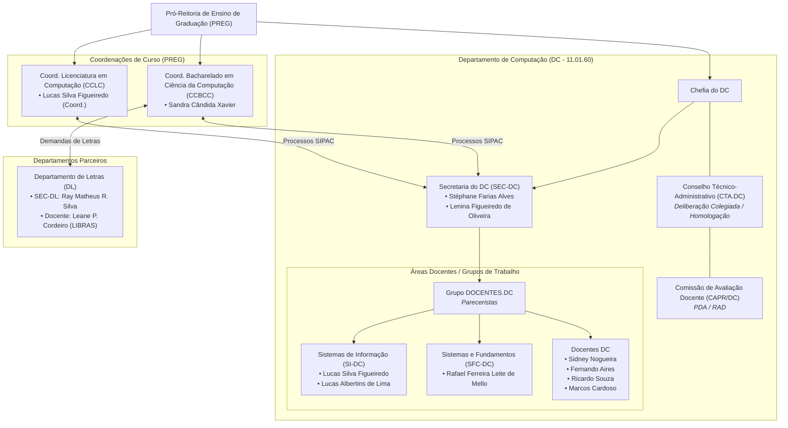

# Organograma e Estrutura Institucional (DC / UFRPE)
> Mapa visual e estrutural das unidades, secretarias, comissões deliberativas e atores acadêmicos do Departamento de Computação.

## 1. Mapa de Governança e Relações Institucionais

---

## 2. Instâncias e Comissões Recorrentes

| Instância / Colegiado | Natureza | Composição Principal | Atribuição Típica |
| :--- | :--- | :--- | :--- |
| **CTA (Conselho Técnico-Administrativo)** | Deliberativa Departamental | Chefia do DC, representantes docentes de cada subunidade e coordenações. | Homologação final de pareceres de equivalência, aprovação de PDA/RAD, afastamentos e matérias administrativas. |
| **NDE (Núcleo Docente Estruturante)** | Consultiva / Propositiva | Docentes do curso (BCC / LC). | Atualização pedagógica do PPC, reformulação de matriz curricular e ementas. |
| **Colegiado de Curso** | Deliberativa de Curso | Coordenador do curso, docentes e representação discente. | Deliberações sobre matrículas, trancamentos, recursos e diretrizes específicas do curso. |
| **CAPR / DC** | Comissão Setorial | Comissão de docentes designada por portaria. | Pareceres sobre Planos Docentes de Atividades (PDA) e Relatórios de Atividades Docentes (RAD). |
| **Secretaria do DC (`SEC-DC`)** | Executiva / Operacional | Stéphane Alves, Lenina Oliveira. | Triagem no SIPAC, protocolo, tramitação de processos, preparação de pautas de reuniões do CTA. |
| **Secretaria do BCC (`CCBCC`)** | Executiva de Curso | Sandra Xavier. | Atendimento discente, autuação de processos de aproveitamento e registro de despachos no SIGAA. |
