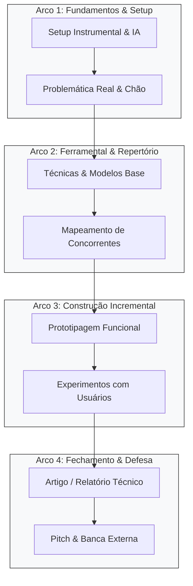

# [nome da disciplina]

> prof. Lucas Silva Figueiredo  
> [Universidade / Departamento]  
> [semestre, ex.: 2026.2]  
> [horário das aulas]  
> [sala física / laboratório]

<!-- guia-ia
instruções para o agente / IA de apoio à disciplina:
1. este arquivo é o documento soberano da disciplina (o próprio site da matéria). ele centraliza comunicação, calendário, regras de avaliação e a lista de artefatos convocados.
2. todas as entregas apontam para arquivos atômicos na pasta 'artefatos/art-[nome].md'. nunca duplique os passos dos artefatos aqui; aponte para os links canônicos.
3. ao interagir com o estudante, ajude-o a localizar seu momento no calendário, pré-requisitos no grafo de conhecimento e os pontos de verificação pendentes.
-->

## canais & comunicação

- **grupo oficial da turma:** [link do whatsapp / telegram / discord]
- **(opcional) videochamadas de acompanhamento:** [link do meet / discord]
- **(opcional) espaços digitais colaborativos:** [link do excalidraw / miro]

---

## propósito & visão (base -> horizonte)

- **a base (ponto de partida):** [descrever o dilema, a dor real ou o gargalo inicial que motiva a existência desta disciplina]
- **o horizonte (onde queremos chegar):** [qual impacto concreto, autonomia e competências duradouras os estudantes constroem ao longo do semestre]

---

## grafo do conhecimento

visão estrutural das competências, conexões e fluxo do aprendizado ao longo dos arcos da disciplina:

> [!TIP]
> cada nó deste grafo se desdobra em aulas teóricas, práticas de laboratório e na produção de artefatos modulares com critérios de aceite explícitos.

---

## calendário de encontros

| # | Data | Dia | Tipo | Tópico da Aula / Atividade | Marcos & Entregas |
|:---:|:---:|:---:|:---:|:---|:---|
| 01 | DD/MM | Seg | Presencial | Abertura, contrato pedagógico e dinâmicas iniciais | Quick win inaugural |
| 02 | DD/MM | Qua | Lab | Setup de ferramentas locais e introdução aos agentes | — |
| 03 | DD/MM | Seg | Presencial | Estudo das dores autênticas e aplicação das 7 alavancas | — |
| 04 | DD/MM | Qua | Lab | Levantamento prático e código rodando em máquina | **Entrega CP-01** |
| — | DD/MM | Seg | Feriado | *Sem aula presencial* | — |
| ... | ... | ... | ... | ... | ... |
| 30 | DD/MM | Qua | Presencial | Banca examinadora externa e encerramento | **Defesa Pública (Pitch)** |

---

## entregas & pontos de verificação

cada entrega é composta por um conjunto de artefatos modulares. cada critério de aceite comprovado nos artefatos adiciona pontos diretamente na pontuação da equipe:

### CP-01: [Nome da Entrega 1, ex.: Problem-Tech Fit]
- **prazo final:** [Data e horário limite, ex.: 16/09 às 23h59]
- **link de submissão:** [Link da linha na Planilha Mestre ou Formulário de Envio]
- **artefatos exigidos:**
  1. [`[Artefato 1: Nome]`](artefatos/art-01.md) — [breve resumo] · *(até 3 pontos)*
  2. [`[Artefato 2: Nome]`](artefatos/art-02.md) — [breve resumo] · *(até 3 pontos)*
  3. [`[Artefato 3: Nome]`](artefatos/art-03.md) — [breve resumo] · *(até 3 pontos)*
- **avaliação intergrupos (+1 ponto):**
  - [ ] A equipe enviou uma análise crítica coerente, profunda e construtiva sobre o trabalho de outra equipe designada.

---

### CP-02: [Nome da Entrega 2, ex.: Prototipagem & Concorrentes]
- **prazo final:** [Data e horário limite]
- **link de submissão:** [Link de envio]
- **artefatos exigidos:**
  1. [`[Artefato 4: Nome]`](artefatos/art-04.md) — [breve resumo] · *(até 3 pontos)*
  2. [`[Artefato 5: Nome]`](artefatos/art-05.md) — [breve resumo] · *(até 3 pontos)*
- **avaliação intergrupos (+1 ponto):**
  - [ ] Análise crítica construtiva enviada para a equipe parceira.

---

## avaliação & regras do jogo

a disciplina opera com **pontos acumulados**: os estudantes e equipes partem do zero e constroem sua pontuação a cada critério validado:

1. **pontuação por artefato:** cada artefato possui de 1 a 3 pontos de verificação atômicos (feito = 1 ponto, não feito = 0).
2. **avaliação intergrupos:** +1 ponto extra por entrega para equipes que realizam revisões de pares aprofundadas e úteis para os colegas.
3. **calibração intragrupo:** formulário anônimo onde cada integrante avalia o engajamento e a contribuição dos pares da sua própria equipe, garantindo justiça interna e evitando caronas.
4. **composição das avaliações (VAs):**
   - **VA1:** Total de pontos acumulados nos checkpoints do Arco 1 e 2.
   - **VA2:** Total de pontos acumulados nos checkpoints do Arco 3 e apresentação do Pitch final perante banca externa.
   - **VA3 / Final:** Prova escrita individual conforme regimento institucional, para quem necessitar de recuperação.

---

## hall da fama (projetos inspiradores)

conquistas e projetos desenvolvidos por turmas anteriores que se desdobraram em trabalhos de conclusão de curso, artigos publicados ou soluções em uso real:

- **[Nome do Projeto A]** ([Semestre])
  - *Destaque:* Virou TCC defendido com nota 10 e aprovado no edital [Nome do Edital].
  - *Entregáveis:* [Link do repositório / Artigo / Vídeo da demonstração]
- **[Nome do Projeto B]** ([Semestre])
  - *Destaque:* Artigo completo aceito no congresso [Nome do Congresso / SBC].
  - *Entregáveis:* [Link do repositório / Artigo]

---

## referências & materiais adicionais

leituras clássicas de base e recursos práticos mais inspiradores para suporte ao desenvolvimento:

### materiais inspiradores & toolkits
- **design toolkit (IDEO):** `https://www.designkit.org/` — referências de ideação centrada no humano.
- **toolkit de inovação (TCU):** ferramentas e dinâmicas colaborativas para projetos públicos e sociais.
- **exemplos de pitch de excelência:** [links de gravações de demonstrações que causam encantamento].

### livros e bibliografia recomendada
- [Livro 1 / Autor / Ano / Por que vale a pena ler]
- [Livro 2 / Autor / Ano / Por que vale a pena ler]
