<!-- page 1 -->

## ESTATUTO DA ASSOCIAÇÃO ECOVILA SANTUÁRIO DOS JATOBÁS

## CAIOI DA DENOMINAÇÃO, SEDE, DURAÇÃO E FINALIDADE

Art. 1° A ECOVILA SANTUÁRIO DOS JATOBÁS, também denominada apenas Santuário dos Jatobás, é uma associação civil de direito privado, de caráter socioambientalista, sem fins lucrativos, de duração indeterminada, fundada em 22 de março de 2021, com personalidade jurídica e patrimônio próprios, e está localizada no Sítio Serra do Boeiro, CEP 55630-000, no Município de Pombos, Estado de Pernambuco.

§1° A Ecovila será regida por este Estatuto, por seu Regimento Interno, pelas resoluções colegiadas da Assembleia Geral e pelas disposições legais aplicáveis à espécie.

§2° A Associação possui personalidade distinta da de seus Associados, os quais não respondem subsidiariamente pelas obrigações por ela contraidas.

§2° Para fins do que determina a Lei Federal n° 13.243/2016, a ECOVILA SANTUÁRIO DOS JATOBÁS é, também, uma Instituição de Ciência e Tecnologia (ICT) Privada.

## Art. 2° O Santuário dos Jatobás tem por finalidades:

- L. Ser um espaço de cuidado coletivo, cultivo de valores fraternais, amorosos, solidários e de resgate e criação de parâmetros comunitários horizontais, sustentáveis, justos e harmoniosos, entre si e com o entorno;
- II. Promover a integração entre seres vivos e seus ambientes e a preservação da
3. natureza em seus valores intrínsecos e simbióticos plurais de sociobiodiversidade;
- II. Garantir a sustentabilidade ambiental, social, cultural, econômica e ecológica;
- IV. Estimular a pesquisa, o desenvolvimento e a implementação de novos modelos de desenvolvimento cooperativos, tecnologias limpas, responsabilidade ambiental, recuperação do solo e técnicas de reflorestamento;
6. V.
7. Buscar soluções, em articulação com ecossistemas de inovação, para problemas alinhados aos objetivos de desenvolvimentosustentável do planeta;
- VI. Realizar a concepção, a estruturação e a gestão sustentável de ecossistemas fisicos e virtuais capazes de promover o encontro de pessoas fisicas e jurídicas em
9. diversidade de saberes, fazeres e experiências, visando ao aprendizado, à geração de

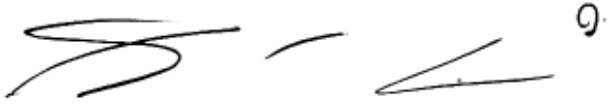

<!-- figure p01-fig1 | described_by: agy | ocr_overlap: None | needs_review: false -->
1. **Kind of figure:**  
A monochrome scan/graphic of handwritten strokes or shorthand/calligraphic symbols alongside a top-right symbol/number on a plain white background.

2. **Visible text:**  
* Upper right: `9.`  
*(The remaining content consists of non-alphabetic handwritten strokes/symbols: an elongated cursive zigzag/S-shaped stroke on the left, a short curved arc in the center, and a horizontal acute angle `<` pointing left on the right.)*

3. **Structure:**  
* **Panel:** Single unbordered horizontal strip/panel.  
* **Layout:** Four distinct isolated marks arranged horizontally:  
  * **Left:** A continuous multi-curve stroke with an acute turn at the top left, sweeping horizontally right, looping back left and downward, with an intersecting flourish.  
  * **Center:** A single standalone curved dash/arc curving convexly upwards.  
  * **Right:** A horizontal open acute angle / wedge shape (`<`) with the vertex pointing left and two arms opening rightwards.  
  * **Top Right:** A stylized numeral `9.` situated above the rightmost stroke.  
* **Connections / Axes / Boxes:** None (no bounding boxes, arrows, grids, tables, or coordinate axes).

4. **Numbers or data values:**  
* `9.` (at the upper-right corner).

5. **Colours:**  
* Black ink strokes on a solid white background (monochrome; color carries no distinct semantic meaning).

1

<!-- page 2 -->

- inovações e à expansão de suas ações no mundo em alinhamento aos objetivos consagrados neste Estatuto;
- VII. Incentivar a resolução alternativa de eventuais conflitos por meio de técnicas restaurativas de autocomposição;
- VIII. Construir relação de diálogo, respeito e cooperação com a comunidade do entorno;
- IX. Implantar projetos e promover intercâmbios nos âmbitos social, educacional, cultural, espiritual, de lazer, de assistência social, arte, práticas integrativas, saúde, turismo e esporte;
- X. Promover e implementar os princípios de Sustentabilidade, Economia Solidária, Permacultura e Agrofloresta.

## (Oo)a ()AS)

## CAPÍTULO II Seção I

## Categorias e Processo de Inclusão de Associados

Art. 3° O quadro de associados da Ecovila Santuário dos Jatobás será constituído por Associado Fundador, Associado Pioneiro, Associado Titular e Associado Voluntário, podendo cada Associado acumular mais de uma categoria.

## §1° As categorias de Associados são assim descritas:

- a) são considerados Associados(as) Fundadores(as) os(as) presentes ou representados(as) na Assembleia Geral de Fundação, Eleição e Posse da Associação;
- b) são Associados(as) Pioneiros(as) aqueles(as) que idealizaram a concepção e apoiaram financeiramente a Ecovila por meio da aquisição dos primeiros Títulos Patrimoniais, bem como contribuíram com o desenvolvimento de suas atividades;
- c) são Associados(as) Titulares(as) aqueles(as) que adquirirem Títulos Patrimoniais da Ecovila Santuário dos Jatobás;
4. oa om oe  aa s sas c conhecimento na Ecovila, podendo ser moradores(as) temporários ou visitantes, conforme demandas da Ecovila definidas pelos seus(suas) associados(as) fundadores(as) e pioneiros(as), ou ainda por extensão do direito de um(a) Associado(a) Titular ouPioneiro.

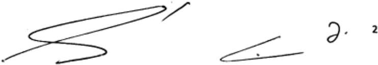

<!-- figure p02-fig1 | described_by: agy | ocr_overlap: None | needs_review: false -->
1. **Type of figure:** A horizontal monochrome excerpt containing handwritten black ink strokes, geometric/cursive lines, a symbol, and a numeral on a plain white background (likely an extracted fragment of a signature, handwritten document, or mathematical/sketch annotation).

2. **Visible text:**
   - There are no titles, legends, captions, axes, or labels.
   - Text/character elements present from left to right:
     - A cursive handwritten flourish/scribble with a short diagonal stroke (`/`) above its upper turn.
     - A handwritten open horizontal angle (`<`) with a small dot inside.
     - A handwritten character resembling `∂.` (or a cursive `d.`).
     - A printed/typed numeral `2`.

3. **Structure:**
   - **Panels/Layout:** A single unbordered horizontal strip.
   - **Left section:** A continuous multi-looped line that begins at the bottom-left, ascends diagonally to the upper-right, loops back leftward across the middle, turns downward and curves rightward, then terminates with a slight left hook at the bottom. A separate short diagonal slash mark (`/`) is positioned above the top-right apex, along with a faint speck.
   - **Center section:** An acute, horizontally oriented V-shape / hairpin open to the right (`<`), with a small dot situated just above the lower arm.
   - **Right section:** A cursive symbol shaped like a partial derivative symbol (`∂`) with a period/dot at its lower right, followed to its right by a freestanding digit `2`.

4. **Numbers and data values:**
   - `2` (located at the far right).

5. **Colours:**
   - Pure monochrome (black strokes on a solid white background); colour carries no specific semantic meaning.

~~~text ocr
=. º
~~~

<!-- page 3 -->

§2° Ainda que detentor de mais de um Título Patrimonial, o(a) associado(a) pioneiro(a) e o(a) titular terá direito a apenas um voto na Assembleia Geral e nas demais instâncias de deliberação de tomada de decisões da Ecovila.

Art. 4º Para ser admitido(a) como Associado(a) Pioneiro, Titular ou Voluntário da Ecovila são necessários os seguintes requisitos:

- I. Apresentação ao Conselho Diretor do pedido de admissão endossado por dois(duas) Associados(as) em dia com as obrigações sociais, contendo anexas as informações básicas de identificação da pessoa pleiteante e a respectiva resposta a formulário elaborado por associados pioneiros;
- II. Ausência de oposição, num prazo de 15 (quinze) dias, por qualquer dos(as) Associados(as) Pioneiros(as) e Titulares em dia com as obrigações sociais, após envio, para cada um(uma), do pedido de admissão e seus anexos;
- III. Aceitação expressa de compromisso pessoal da pessoa pleiteante, por escrito, com os princípios da Associação;
- IV. Submissão às normas estatutárias e ao regimento interno da Associação.

§1° O Regimento Interno irá especificar o Processo de Integração de cada novo(a) associado(a).

§2° Antes da fase inicial de aquisição da terra, o Conselho Diretor poderá estabelecer procedimento diverso de ingresso de associados(as) pioneiros(as).

Art. 5° Poderão ser excluídos do quadro da Associação:

1. Os(as) Associados(as) que deixarem de efetuar o pagamento das contribuições pelas quais estiverem obrigados;
- II. Os(as) Associados(as) que, por sua conduta irregular, tenha(m) causado dolosamente danos às pessoas e ao patrimônio da Ecovila, ou ainda que deixarem de cumprir o Estatuto e o Regimento Interno no todo ou em parte, sendo tais questões consideradas justa causa para exclusão, nos termos deste estatuto.

Parágrafo Único. Após seguido o procedimento previsto no Regimento Interno, garantida a ampla defesa, da decisão caberá recurso do(a) interessado(a) à Assembleia Geral, cujo resultado, mantendo ou revogando a medida, terá força obrigatória geral e eficácia definitiva.

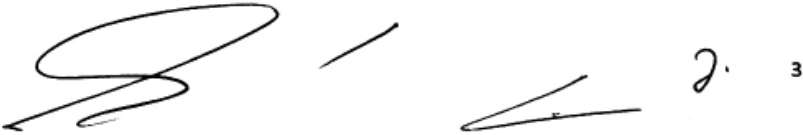

<!-- figure p03-fig1 | described_by: agy | ocr_overlap: None | needs_review: false -->
1. **Type of Figure**: A monochrome horizontal strip containing handwritten line strokes, geometric doodles/scribbles, and alphanumeric symbols arranged linearly from left to right across a blank background.

2. **Visible Text**:
   - `3` (located at the far right)
   - A handwritten character resembling `∂.` (or a cursive `d.` / `2.`) immediately to the left of the `3`
   *(No titles, captions, axis labels, legends, or table headers are present).*

3. **Structure**:
   The figure contains no boxes, panels, tables, arrows, or coordinate axes. It consists of five distinct graphical elements positioned horizontally in a single row from left to right:
   - **First element (leftmost)**: A continuous, multi-loop cursive drawing composed of a sharp bottom-left hook extending into a large horizontal loop at the top, which sweeps back down, crosses over itself, and finishes in a lower wavy horizontal curve.
   - **Second element (center-left)**: A straight, isolated diagonal stroke sloping upward from bottom-left to top-right, ending with a small dot at the upper tip.
   - **Third element (center-right)**: A sharp acute angle opening to the right (a sideways V-shape pointing left), formed by a top stroke meeting a bottom stroke at a sharp left vertex.
   - **Fourth element (right)**: A curved handwritten symbol resembling a partial derivative symbol (`∂`) or cursive loop with a trailing dot/period.
   - **Fifth element (far right)**: A standalone digit `3`.

4. **Numbers and Data Values**:
   - `3` (single integer value located at the far right).

5. **Colours**:
   - Black strokes/text on a solid white background; color does not convey semantic data.

<!-- page 4 -->

LWANAW

WNA

## Seção II Dos Direitos e dos Deveres dos(as) Associados(as)

Art. 6º São direitos dos(as) Associados(as) Pioneiros(as) e Titulares, desde que sejam maiores de 18 anos e estejam regulares com suas obrigações sociais:

- I. Votar e serem votados nas eleições realizadas para provimento de qualquer cargo integrante dos diferentes órgãos da Associação;
- II. Requerer a convocação de Assembleias Gerais Extraordinárias, mediante requerimento dirigido ao Presidente do Conselho Diretor, assinado por, no mínimo, 1/5 (um quinto) dos Associados(as) Pioneiros(as) e Titulares quites com as obrigações da Associação e no gozo dos direitos que lhes são reconhecidos nestes Estatuto;
- III. Participar das Assembleias Gerais Ordinárias e Extraordinárias, nelas votando sobre todas as matérias objeto de deliberação;
- IV. Propor por escrito, ao Conselho Diretor ou à Assembleia Geral, as medidas que considerem convenientes ao interesse social.

Art. 7° Além dos direitos citados no artigo anterior, os(as) Associados(as) Pioneiros(as) e Titulares terão direito ao usufruto de área privativa correspondente ao seu Título Patrimonial, seguido o Regimento Interno.

§1° Os(as) Associados(as) Pioneiros (as) e Titulares poderão estender esse usufruto aos Associados Voluntários que indicarem.

§2° À exceção dos membros do núcleo familiar (cônjuge, companheiro(a), ascendentes, descendentes e dependentes no geral), demais associados(as) voluntários(as) deverão ser aprovados e integrados, nos termos do Art. 4°.

Art. 8° São deveres comuns a todos(as) os(as) Associados(as):

- I. Respeitar o presente Estatuto, o Regimento Interno, as deliberações das Assembleias Gerais, do Conselho Diretor e do Conselho Fiscal;
- II. Contribuir pontualmente com os aportes financeiros e o trabalho aos quais se tenham obrigado;
- III. Prestar sua efetiva cooperação ao desenvolvimento da Ecovila Santuário dos Jatobás e ao cumprimento de suas finalidades.

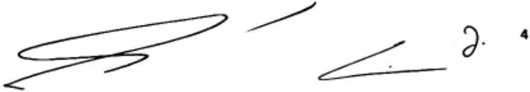

<!-- figure p04-fig1 | described_by: agy | ocr_overlap: None | needs_review: false -->
1. **Kind of figure:** A horizontal black-and-white graphic/document snippet containing a stylized handwritten signature (cursive pen strokes), a small handwritten glyph/initial, and a printed digit.

2. **All visible text, verbatim:**
   - The primary handwritten signature strokes across the left and center are stylized and illegible as words: `[illegible]`
   - Handwritten symbol near the right: `∂.` (or cursive `d.`)
   - Printed character at the far right: `4`

3. **Structure:**
   - **Overall layout:** A single unbordered horizontal strip on a plain white background, with no panels, boxes, tables, or axes.
   - **Left section:** A long, continuous cursive pen stroke forming a wide, elongated horizontal loop pointing to the right, looping back leftwards, and terminating in a sharp, zig-zag flourish beneath the main loop.
   - **Top-center:** A separate, short diagonal curved stroke rising upwards to the right.
   - **Bottom right-center:** A sharp horizontal hairpin/acute angle opening to the right, with a tiny ink dot located within the inner angle.
   - **Right section:** A small handwritten looped symbol (resembling a cursive lowercase "d" or partial derivative sign "∂") followed by a period.
   - **Far right edge:** An isolated, upright, bold printed numeral aligned vertically near the center-right.

4. **Every number or data value:**
   - `4` (located at the far right).

5. **Colours:**
   - Black ink on a solid white background (monochrome; color carries no semantic meaning).

S

<!-- page 5 -->

Parágrafo Único. É dever dos(as) Associados(as) Pioneiros (as) e Titulares responder por eventuais faltas e danos dos Associados Voluntários a ele vinculados, bem como seus dependentes e convidados.

## CAPÍTULO III DA RESOLUÇÃO DE CONFLITOS

Art. 9º O(a) associado(a) que descumprir as obrigações previstas neste Estatuto, no Regimento Interno, nas resoluções do Conselho Diretor e nas deliberações da Assembleia Geral será convidado para reunião com a Comissão de Mediação de Conflitos.

Art. 10° Em caso de não comparecimento injustificado à reunião ou restando infrutífero o procedimento de responsabilização conduzido pela Comissão de Mediação de Conflitos, será aberto processo disciplinar, garantido o direito de apresentação de defesa escrita, no prazo de 5 dias úteis, contados a partir do recebimento da notificação.

As  s sas as ss  ss e ss sd   na aplicada:

- I. Advertência;
- II. Censura;
- III. Suspensão; e,
- IV. Exclusão.

§1° Nenhuma ação de responsabilização será aplicada sem o convite à reunião com a Comissão de Mediação de Conflitos nem a ciência prévia do associado quanto à falta que lhe é imputada, sendo-Ihe sempre facultado o direito à ampla defesa.

§2° Apresentada ou não a defesa, o Conselho Diretor deliberará sobre a infração, decidindo sobre a aplicabilidade da punição.

Art. 12 As penas e os procedimentos administrativos e de responsabilização, este último

conduzido pela Comissão de Resolução de conflitos, serão definidos no Regimento Interno. Parágrafo único. Na aplicação das penalidades previstas no Regimento, serão consideradas a

natureza da infração e o dano que dele resultar para a comunidade.

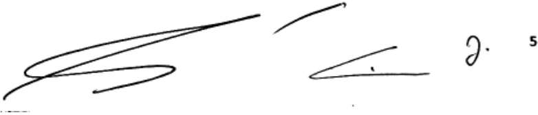

<!-- figure p05-fig1 | described_by: agy | ocr_overlap: None | needs_review: false -->
1. **Type of figure**: A scanned horizontal image containing a handwritten signature/rubric alongside stylized cursive marks and a printed digit.

2. **Visible text**:
   - Signature / cursive strokes: [illegible]
   - Far right: `5`

3. **Structure**:
   - **Left section**: An elongated, stylized cursive signature composed of sharp, overlapping horizontal and diagonal loops stretching from the lower-left to the upper-center.
   - **Center section**: A short upward diagonal stroke near the top, with a sharp, left-pointing angle stroke below it containing a small ink dot.
   - **Right section**: A small isolated handwritten loop/character resembling a cursive flourish or initial (`∂.` / `J.`).
   - **Far right edge**: The printed numeral `5` aligned to the upper right.
   - There are no panels, boxes, tables, axes, or arrows.

4. **Numbers and data values**:
   - `5` (located at the far right edge).

5. **Colours**:
   - Black marks/ink on a white background; colour carries no specific data meaning.

~~~text ocr
a
~~~

<!-- page 6 -->

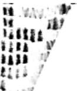

<!-- figure p06-fig1 | described_by: agy | ocr_overlap: None | needs_review: false -->
1. **Kind of figure:** A cropped, low-resolution, grayscale image fragment showing a matrix-like pattern of dark vertical bands, streaks, or spots against a white background (resembling a cropped region of an electrophoresis gel, blot, or autoradiograph).

2. **Visible text:** There is no legible text present in the image (no titles, labels, legends, captions, axis ticks, or cell values). Any indistinct markings that might represent characters are [illegible].

3. **Structure:** 
   - **Panels:** Single cropped panel without borders or dividing lines.
   - **Rows and Columns:** Dark vertical marks arranged in a stepped/triangular grid pattern:
     - The left side features roughly 5 columns of vertically aligned dark rectangular/ovoid marks across approximately 6 to 7 rows, tapering down in column height from left to right.
     - A diagonal boundary extends from the lower-left/center toward the upper-right corner.
     - Along the upper-right diagonal margin, several additional slanted/vertical dark marks are visible.
   - **Boxes, Arrows, Axes:** There are no boxes, arrows, connecting lines, axes, or tick marks.

4. **Numbers or data values:** None visible.

5. **Colours:** The figure is entirely monochrome/grayscale (black, gray, and white); color carries no distinct semantic meaning.

~~~text ocr
“
|
~~~

Art. 13 Consideram-se infrações administrativas as praticadas por Conselheiros Diretores e Conselheiros Fiscais, no exercício de suas atribuições Estatutárias, que importarem em prejuízos administrativos e materiais contra a Ecovila ou associado(a).

Art. 14 As infrações administrativas serão punidas com a perda do cargo, mediante processo administrativo instaurado pelo Diretor Presidente, e julgado pelo voto de 2/3 (dois terços) dos presentes em Assembleia Geral, nos casos de infração cometida por membros eleitos pelo voto direto. Nos demais casos, o processo administrativo será julgado pelo Conselho Diretor.

Parágrafo único. Caso a infração administrativa tenha sido cometida pelo Presidente, procedimento administrativo pode ser instaurado por outro membro do Conselho Diretor, sendo submetido à decisão da Assembleia Geral, garantida a ampla defesa.

## Capítulo IV

## DAS FONTES DE RECURSO PARA MANUTENÇÃO DA ASSOCIAÇÃO

## Art. 15 O patrimônio da Associação será constituído por:

- L. Bens móveis e imóveis que a Associação vier a possuir;
- II. Excedente da Receita sobre a Despesa, apurado anualmente;
- III. Receita da venda de Títulos Patrimoniais, respeitados os limites do Regimento Interno.

## Art.16 A Receita será constituída por:

- I. Contribuições de Associados;
2. Venda de produtos e serviços;
3. ⅢII. Venda dos Títulos Patrimoniais;
- IV. Doações, subvenções ou legados.

Art. 17 A Despesa será constituída de todos os gastos necessários ao funcionamento da Ecovila Santuário dos Jatobás ou efetivação de seus objetivos e finalidades, sendo que dependerão de autorização do Presidente do Conselho Diretor, respeitados os limites definidos no Regimento Interno e neste Estatuto.

§1° É proibido ao Conselho Diretor contribuir ou avalizar, por conta e responsabilidade da Associação, para qualquer finalidade estranha aos seus objetivos.

§2° As alterações substanciais do patrimônio poderão ser feitas por proposta do Conselho Diretor dentro do limite estabelecido no Regimento Interno, ou aprovadas pela Assembleia Geral, com a presença de 2/3 (dois terços) dos Associados com direito a voto e aprovação por maioria absoluta.

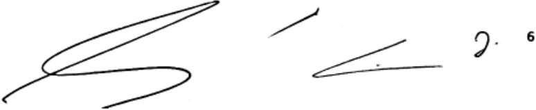

<!-- figure p06-fig2 | described_by: agy | ocr_overlap: None | needs_review: false -->
1. **Kind of figure:**
A monochrome horizontal excerpt/figure containing handwritten strokes (such as signature components or handwriting samples) accompanied by a printed numeral.

2. **Visible text:**
* Far right: `6`
*(No other titles, captions, legends, axis labels, or cell values are present).*

3. **Structure:**
The figure consists of a single horizontal panel on a plain white background without axes, frames, boxes, or arrows. From left to right, it features:
* **Left section:** A large, sweeping, continuous cursive stroke/flourish that extends diagonally from the bottom-left toward the upper-right in a long loop, crosses back over itself, and curves horizontally to the right before looping back left at the bottom.
* **Center (upper):** A short isolated diagonal stroke slanting upward from left to right.
* **Center-right (lower):** A sharp horizontal acute-angle / hairpin mark pointing to the left (`<` shape).
* **Right section:** A handwritten cursive character with a loop and a dot (resembling a cursive `d.` or `J.`).
* **Far right:** A small printed digit `6`.

4. **Numbers and data values:**
* `6` (located on the far right).

5. **Colours:**
Black lines and text on a white background (monochrome; colors carry no specific semantic meaning).

<!-- page 7 -->

## CAPÍTULO V DA AUTOGESTÃO E AUTO ORGANIZAÇÃO

Art. 18 A Associação Ecovila Santuário dos Jatobás é regida pelo sistema de colegiados, por meio dos seguintes órgãos:

- I. Assembleia Geral;
- II. Conselho Diretor;
- III. Conselho Fiscal.

Parágrafo único. Os membros dos Conselhos e demais órgãos administrativos da associação não respondem solidariamente perante terceiros por quaisquer obrigações assumidas pela associação.

## Seção I

## Da Assembleia Geral

## Art.19À Assembleia Geral, órgão supremo daassociação, cabe:

- I. Eleger, a cada dois anos, no mês de novembro, o Conselho Diretor e o Conselho Fiscal;
- II. Reformar o presente Estatuto, mediante reunião extraordinária convocada especificamente para tal fim;
- III. Emitir diretrizes para funcionamento interno da Associação e aprovar a Carta de Princípios Internos;
- IV. Autorizar a emissão de novos títulos, além dos originalmente previstos, fixando-lhes a quantidade;
- V. Apreciar e julgar as contas do Conselho Diretor, no final de cada exercício;
- VI. Determinar a dissolução ou extinção da associação, mediante aprovação de %(três quartos) de associados(as) titulares quites com as obrigações assumidas perante a entidade;
- VII. Deliberar sobre assunto de interesse geral;
- VIII. Autorizar operações de crédito, propostas pelo Conselho Diretor, superiores a 100 (cem) salários mínimos vigentes;
- IX. Destituir os(a) conselheiros(as) na forma deste Estatuto.

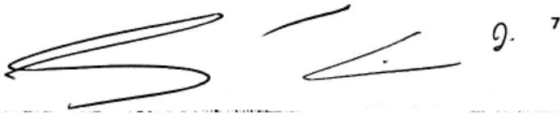

<!-- figure p07-fig1 | described_by: agy | ocr_overlap: None | needs_review: false -->
1. **Type of Figure**: 
A horizontal black-and-white scanned snippet containing handwritten pen strokes, cursive/script markings, and a printed/written index numeral.

2. **Visible Text**:
- `7` (located at the upper right).
- `J.` (or cursive `9.` / `I.`, located to the left of `7`).
- There are no other legible words, titles, labels, legends, captions, axis ticks, or cell values.

3. **Structure**:
- **Left section**: A continuous handwritten stroke consisting of a long, narrow loop extending upwards and to the right, returning downward to form a horizontal zigzag/wave shape.
- **Center-top section**: A standalone short stroke curving gently upwards to the right.
- **Center-bottom section**: A sharp acute angle (sideways 'V' shape) pointing left and opening to the right, containing a single small ink dot near the inside vertex.
- **Right section**: A cursive loop symbol (`J.` / `9.`) accompanied by a superscript-positioned number `7` at the far right.
- The image contains no panels, boxes, connecting arrows, tables, or coordinate axes.

4. **Numbers / Data Values**:
- `7` (at the top-right corner).
- `9.` (if the adjacent cursive glyph is interpreted as a numeral).

5. **Colours**:
- Monochrome black ink on a white background; the colors carry no specific categorical or semantic meaning.

~~~text ocr
| =
~~~

<!-- page 8 -->

Art. 20A Assembleia Geral Ordinária ocorrerá mensalmente.

Art. 21 A Assembleia Geral se reunirá, extraordinariamente, quando convocada pelo Presidente do Conselho Diretor ou por 1/5 (um quinto) dos associados titulares, mediante pedido escrito e fundamentado, dirigido ao Conselho Diretor.

Parágrafo único. No caso de deliberação acerca da dissolução da entidade, a Assembleia Geral Extraordinária deve ser convocada especificamente para este fim por, no mínimo, 2/3 dos associados proprietários.

Art. 22 A Assembleia Geral, ordinária e extraordinária, será convocada por edital fisico e virtual, afixado na sede da associação, publicado nas redes sociais e enviado para todos os cootatos eletrònicos de associados(as), duas vezes seguidas, não podendo a primeira publicação distar menos de cinco dias da data fixada para a realização da Assembleia.

Art. 23A Assembleia Geral deliberará, em primeira convocação, com, no mínimo, dois terços dos associados Pioneiros(as) e Titulares, ou pelos associados voluntários por estes indicados e constituidos por instrumento de representação, ; em segunda convocação, com um terço; e, em terceira convocação, com qualquer número de associados quites com os compromissos assumidos perante a Associação.

Art. 24 O edital de convocação da Assembleia Geral fixará, desde logo, o horário das três convocações estatutárias, devendo, entre a segunda e terceira convocação, mediar um prazo minimo de 01(uma) hora entre uma convocação e outra.

Parágrafo Único. Os participantes das Assembleias Gerais devem assinar o livro de Presença. Art. 25 A Assembleia Geral pode ser coordenada por qualquer membro do Conselho Diretor, escolhido pelos presentes.

§1° Os processos de tomada de decisão na Associação são fundamentados pela transparência, democratização de informações, corresponsabilidade, diálogo propositivo, foco em soluções e harmonização das diferenças, na busca de decisões que possam ser prioritariamente apoiadas e consensuadas por todos/as.

§2° A Assembleia Geral busca deliberar preferencialmente mediante consenso; na sua impossibilidade, delibera-se por maioria simples dos membros presentes.

§3°A ata será disponibilizada, via e-mail, para todos(as) os(as) associados(as).

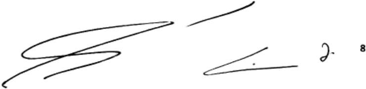

<!-- figure p08-fig1 | described_by: agy | ocr_overlap: None | needs_review: false -->
1. **Type of Figure:**
A monochrome scanned excerpt/figure containing handwritten signatures, pen strokes, and a printed numeral on a white background.

2. **Visible Text:**
- `[illegible]` (stylized handwritten cursive signatures/strokes across the left and middle areas)
- `8` (printed numeral on the far right)

3. **Structure and Layout:**
The image is arranged horizontally on a plain white background with no panels, boxes, tables, arrows, or coordinate axes. The elements from left to right are:
- **Left side:** A prominent, elongated handwritten signature consisting of horizontal cursive loops and sweeping flourishes.
- **Top-center:** A single separate diagonal pen stroke ascending toward the right.
- **Lower-right center:** A sharp, acute horizontal angle pointing toward the left with a small dot situated inside the angle.
- **Right (middle-right):** A small cursive looped character or flourish.
- **Far right:** A standard, upright printed numeral `8`.

4. **Numbers and Data Values:**
- `8`

5. **Colours:**
Monochrome (black ink on a solid white background); colour carries no specific semantic meaning.

<!-- page 9 -->

## Seção II

## Do Conselho Diretor

## Art. 26O Conselho Diretor é constituido pelos seguintes cargos:

- Presidente(a);
- II. Vice-Presidente(a):'
- ll. Secretário(a);
- IV. Diretor(a) Financeiro;
- V. Diretor(a)de Arquitetura.

§1° Os membros do Conselho Diretor devem ser eleitos e empossados pela Assembleia Geral.

Art. 27 Ocorrendo vacância de quaisquer das funções eletivas, por renúncia, desligamento ou morte, o Conselho Diretor se reunirá e escolherá outro(a) associado(a) para o exercício até o término do mandato em curso.

- Art. 28O Conselho Diretor se reunirá ordinariamente a cada mês, e quando convocado pelo seu Presidente.
- Art. 29 Perderá o mandato o(a) conselheiro(a) que faltar a três reuniões consecutivas, sem justificação.

## Art. 30Compete ao Conselho Diretor:

- I. Cumprir o presente Estatuto;
- II. Regulamentar as Diretrizes da Assembleia Geral e emitir resoluções para disciplinar o funcionamento intero da Associação;
- III. Executar as diretrizes anuais tal como definido em Assembleia Geral;
- IV. Encaminhar às(aos) associadas(os) propostas de admissão de novos(as) associados(as), após verificação preliminar dos requisitos do Art. 4º deste Estatuto;
- V. Promover contatos com instituições públicas e privadas para mútua colaboração em atividades de interesse comum;
- VI. Atribuir a associado(a) de sua escolha função administrativa pertinente, com ou sem designação específica, pelo tempo de eleição restante dos demais membros do Conselho, em caso de vacância;
- VII. Criar e desenvolver novas atividades dentro dos fins da Associação;
8. VIll. Deliberar sobre assuntos administrativos, econômicos e patrimoniais;

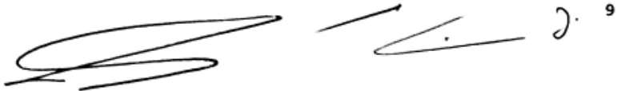

<!-- figure p09-fig1 | described_by: agy | ocr_overlap: None | needs_review: false -->
1. **Type of figure:** A horizontal monochrome snippet containing hand-drawn scribbles/markings, an arrow, geometric strokes, and a printed number.

2. **Visible text (verbatim):**
   - `9` (printed in bold at the top right)
   - [illegible] (the handwritten marks on the left and far right do not form legible words, though punctuation-like dots are present: one dot `.` inside the angle and one dot `.` following the rightmost curved stroke).
   - No titles, captions, axis labels, legends, or table cells are present.

3. **Structure:**
   - **Single panel:** Set on a plain white background arranged horizontally from left to right:
     - **Left:** A wide, continuous cursive scribble forming overlapping horizontal loops with a line cutting through near the bottom.
     - **Center-top:** A straight diagonal arrow pointing upwards and to the right ($\nearrow$).
     - **Center-right:** A horizontal acute angle pointing left ($<$), opening towards the right, with an isolated dot centered between its arms near the vertex.
     - **Far right:** A small curved, hook-like stroke (resembling `∂`) followed by a period (`.`).
     - **Top right:** The printed digit `9` positioned in the upper right margin.

4. **Numbers and data values:**
   - `9`

5. **Colours:**
   - Black ink on a solid white background; colour carries no specific meaning.

<!-- page 10 -->

- IX. Contratar e demitir funcionários ou colaboradores, após deliberação em Assembleia Geral;
- X. Realizar operações de crédito não excedentes a 100 (cem) salários mínimos
11. 1 TX Prestar, anualmente, contas de sua administração à Assembleia Geral, além da apresentação de balancetes e demonstrativos mensais com divulgação ampla entre associados(as);
- XII. Representar a Associação e praticar todos os demais atos que se fizerem necessários à boa administração geral.

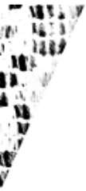

<!-- figure p10-fig1 | described_by: agy | ocr_overlap: None | needs_review: false -->
### 1. Kind of Figure
This is a cropped, high-contrast monochrome image fragment (likely an extracted visual artifact, pattern segment, or portion of a larger matrix, heatmap, gel electrophoresis, or textured graphic).

### 2. Visible Text
None. There is no text, title, label, legend, caption, axis tick, or cell value visible.

### 3. Structure
- **Overall composition:** The image consists of a patterned region restricted to the upper-left section, bounded by a diagonal, slightly curved edge running from the bottom-left toward the top-right. The bottom-right area outside this boundary is completely plain white space.
- **Pattern layout:** Inside the patterned area, there is a grid-like arrangement composed of several vertical columns and rows of short, dark vertical dashes, rectangular blocks, and band-like markings on a white background.
- **Connectors / Elements:** There are no boxes, arrows, connecting lines, axes, distinct panels, or annotations.

### 4. Numbers and Data Values
None. There are no numeric values, coordinates, scales, or data points displayed.

### 5. Colours
Monochrome (black markings on a white background with minor grayscale edge gradations). No colour coding or semantic colours are present.

~~~text ocr
mre y
tb
’
~~~

## Seção III Das atribuições dos membros do Conselho Diretor

## Art. 31 Compete ao(à) Presidente(a), além de outras atribuições inerentes ao seu cargo:

- I. Assinar, com o(a) Diretor(a) Financeiro, cheques, ordens de pagamento ou quaisquer documentos que envolverem responsabilidade financeira;
- II. Assinar, juntamente com o Diretor Secretário, os títulos e editais de convocação de competência do Conselho Diretor;
- III. Presidir reuniões de Diretoria e convocá-las extraordinariamente;
- IV. Representar a Ecovila, ativa e passivamente, judicial e extrajudicialmente;
- V. Delegar, quando necessário, atribuições a outros membros do Conselho Diretor.

## Art. 32Compete ao Vice-Presidente:

- I. Substituir o Presidente em suas faltas e impedimentos e sucedê-lo em caso de vacância;
- II. Colaborar com o Presidente na organização do plano de trabalho da entidade, elaboração de relatórios, regulamentos, registros e resoluções.

Parágrafo único. Além das atribuições acima, poderá o(a) Vice Presidente(a) receber poderes temporários que lhes sejam expressamente atribuídos pelo Presidente.

## Art. 33 Compete ao(à) Diretor(a) Secretário(a):

- I. Incumbir-se da organização do expediente do Conselho Diretor e da Assembleia Geral;
- II. Redigir e assinar os editais de convocação de competência do Conselho Diretor;
- III. Manter em ordem, sob sua responsabilidade, os arquivos e livros da secretaria;

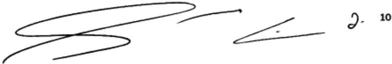

<!-- figure p10-fig2 | described_by: agy | ocr_overlap: None | needs_review: false -->
1. **Kind of figure**: 
A horizontal monochrome snippet extracted from a document, featuring handwritten pen strokes / a cursive signature fragment followed by a handwritten mark and a printed number.

2. **Visible text**:
- [illegible] (handwritten cursive signature/strokes on the left and center)
- `10` (printed in bold type at the far right)

3. **Structure**:
The figure consists of elements arranged horizontally on a plain white background with no axes, grids, borders, or panels:
- **Left section**: A wide, flowing cursive stroke with elongated horizontal loops moving back and forth across the left half.
- **Center top**: A single smooth, upward-curving stroke extending to the right.
- **Center right**: A sharp, horizontal acute-angle stroke pointing to the left (`<`), with a small dot situated inside its open angle.
- **Far right**: A small looped cursive character/mark resembling `2.` (or a flourished script mark), immediately followed by the printed number `10`.

4. **Numbers and data values**:
- `10` (printed integer value at the far right)

5. **Colours**:
Black ink/print on a solid white background (monochrome; color does not carry distinct categorical or semantic meaning).

<!-- page 11 -->

## IV. Redigir as atas de todas as reuniões.

## Art. 34 Compete ao(à) Diretor(a) Financeiro:

- I. Gerenciar o serviço de tesouraria, informando ao Conselho Diretor as questões que digam respeito a assuntos financeiros;
- II. Levantar os dados necessários à elaboração da proposta orçamentária até o dia dez de dezembro para o ano subsequente;
- III. Ter, sob sua guarda e responsabilidade, os livros de contabilidade e documentos de caixa;
- IV. Organizar, conferir e pagar, desde que autorizado pelo(a) Presidente(a), as contas de responsabilidade da Ecovila;
- V. Assinar, com o Presidente, cheques, contratos e documentos de operações financeiras;
- VI. Publicar, mensalmente, o balancete da receita e despesa, afixando-o em local próprio da Ecovila, e enviando-o virtualmente para os associados.

## Art. 35 Compete ao(à) Diretor(a)de Arquitetura:

- I. Opinar, fiscalizar e emitir parecer a qualquer obra de construção, melhoramento, reforma ou conservação a ser executada na associação;
- II. Cadastrar e manter, sob sua responsabilidade, os bens móveis e imóveis da Associação;
- III. Acompanhar e fiscalizar a construção de imóveis, bem como qualquer serviço de reforma de prédio já existente;
- IV. Orientar e indicar as localidades de construção das áreas privativas e aquelas afetas aos projetos de reflorestamento;
- V. Aprovar as plantas dos projetos de construção e reforma a serem realizadas nas áreas privativas.

## Seção IV Do Conselho Fiscal

Art. 36O Conselho Fiscal será constituído de dois membros efetivos, eleitos pela Assembleia Geral, com mandato de dois anos, tendo por incumbência:

- I. Examinar, mensalmente, o balancete da Diretoria e encaminhá-lo, com parecer, à Assembleia Geral;

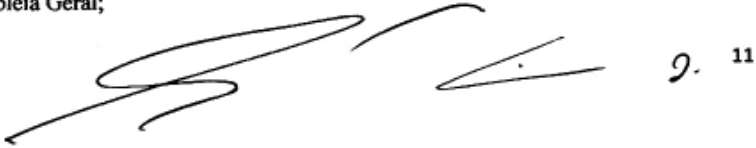

<!-- figure p11-fig1 | described_by: agy | ocr_overlap: None | needs_review: false -->
**(1) Tipo de figura:**
Trata-se de um recorte/fragmento de um documento digitalizado (extraído de um PDF), contendo um trecho truncado de texto impresso, uma assinatura/rubrica manuscrita e uma numeração.

**(2) Todo o texto visível (verbatim):**
- Canto superior esquerdo: `bleia Geral;` (fragmento cortado de texto tipográfico impresso)
- Região central/direita: rubrica/assinatura manuscrita em traços cursivos
- Lado direito (abaixo/junto ao traço final da rubrica): `J.` (inicial ou caractere manuscrito pontuado)
- Canto superior direito: `11` (número impresso em fonte com serifa)

**(3) Estrutura:**
- A imagem não possui caixas, setas, eixos, linhas, colunas, tabelas ou divisões em painéis.
- No canto superior esquerdo, há uma porção final de uma linha de texto impresso alinhada à esquerda.
- No centro, estende-se horizontalmente uma assinatura/rubrica manuscrita fluida com laçadas amplas e um traço pontiagudo em cunha à direita que contém um pequeno ponto em seu interior.
- À direita da assinatura, encontra-se a marcação manuscrita (`J.`) e, mais acima, o número impresso `11`.

**(4) Números ou valores de dados:**
- `11` (número impresso no canto superior direito, possivelmente indicando paginação ou numeração de cláusula).

**(5) Cores:**
- Monocromática (traços em preto sobre fundo branco), sem variação de cores com significado funcional.

<!-- page 12 -->

- II. Dar parecer sobre as contas do Conselho Diretor em cada exercício;
- III. Fiscalizar operações de crédito incluídas na competência da Diretoria;
- IV. Auditar, periodicamente, a tesouraria da Ecovila, por, pelo menos, 06 (seis) vezes ao ano.

Art. 37 O Conselho Fiscal se reunirá, sempre que necessário, para cumprimento das atribuições previstas no artigo anterior.

## CAPÍTULO VI DAS CONSTRUÇÕES

Art.38 São asseguradas ao(à) associado(a) titular as garantias em relação à área privativa correspondente ao titulo por ele(a) adquirido(a).

Art. 39 As construções serão precedidas de prévia autorização do Conselho Diretor, que analisará o projeto dentro de 30 (trinta) dias consecutivos, findos os quais, na ausência de pronunciamento, será tido como automaticamente aprovado.

Pa raao o o aeo ee o a  o e  o eaao Conselho Diretor, que decidirá como última instância, dentro do prazo de 20 (vinte) dias, contados a partir do recebimento do aviso.

## CAPÍTULO VII

## DAS DISPOSIÇÕES GERAIS E TRANSITÓRIAS

Art. 40 O exercício social da Ecovila Santuário dos Jatobás será encerrado em 31 de Dezembro de cada ano, coincidindo assim, com o do ano civil.

Art. 41 A reforma do presente Estatuto se dará da seguinte forma:

- I. A Assembleia Geral será convocada, extraordinariamente, pelo Conselho Diretor ou por um quinto, no mínimo, dos(as) associados(as) pioneiros(as) e titulares para deliberar acerca de proposta de reforma parcial ou total do Estatuto, devendo o edital ser amplamente divulgado por meio de redes sociais, e-mails, cartazes, na sede da ecovila, dependências internas etc;
- II. A reforma ocorrerá, imediatamente, em reunião única da Assembleia Geral, ou, quando por decisão de metade mais um dos presentes, o projeto for entregue a uma comissão de cinco associados(as) pioneiros(as) e titulares para análise e parecer no prazo máximo

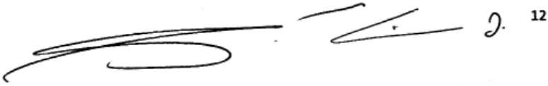

<!-- figure p12-fig1 | described_by: agy | ocr_overlap: None | needs_review: false -->
(1) **Type of figure:**
A cropped black-and-white image snippet showing a stylized handwritten signature or autograph accompanied by a printed number.

(2) **Visible text:**
- Handwritten signature / text: [illegible]
- Printed number (top right): `12`

(3) **Structure:**
- The image consists of a single unbordered horizontal panel on a plain white background.
- **Left section:** A long, flowing handwritten stroke featuring horizontal lines and elongated loops extending to the right and curving back left underneath.
- **Middle section:** Disconnected strokes including a short diagonal line at the top, a sharp horizontal chevron/wedge shape pointing to the left with a small dot inside, and a small loop mark with a period (resembling a cursive initial `J.`) to the right.
- **Top right:** The printed numeral `12` positioned in superscript alignment relative to the signature line.
- There are no charts, axes, arrows, bounding boxes, or tabular rows/columns.

(4) **Numbers and data values:**
- `12`

(5) **Colours:**
- Monochrome black ink on a white background; colour carries no distinct semantic meaning.

<!-- page 13 -->

3. Dea Detd oe Deon es dDcosa d Deoosn s ese oeoona se  dra deliberação da Assembleia Geral;
- III. O projeto de reforma, quando de sua discussão pelo plenário, será analisado por capítulos, não se admitindo análise de disposições já aprovadas, salvo em caso de flagrante contradição do texto estatutário;
- IV. Para as deliberações de que trata o presente artigo, é exigido o voto concorde de dois terços dos presentes à assembleia, não podendo ela deliberar, em primeira convocação, sem a maioria absoluta dos associados quites com suas obrigações sociais, ou com menos de um terço nas convocações seguintes.
6. Art. 42 As alterações efetivadas neste Estatuto, em Assembleia Geral Extraordinária, convocada para esta finalidade, não gerarão qualquer tipo de direito retroativo à data da sua publicação, que implique ônus aos cofres da Ecovila, tampouco poderão alterar a forma de designação do Conselho Diretor.
7. Art. 43 A Ecovila será dissolvida e extinta, em Assembleia Geral extraordinária, quando não atender mais aos fins propostos neste Estatuto, mediante aprovação de / (três quartos) de associados(as) pioneiros(as) e titulares quites com as obrigações assumidas perante a entidade.
8. Parágrafo único. Dissolvida a Associação, o remanescente do seu patrimônio líquido, depois de resgatados os Títulos Patrimoniais devidamente atualizados, será destinada a outra associação por deliberação dos(as) Associados(as).
9. Art. 44 O presente Estatuto entrará em vigor na data do seu registro, no Cartório de Títulos e Documentos, que será realizado pelo Conselho Diretor no prazo máximo de trinta dias de sua aprovação em Assembleia Geral.
10. Art.45 Após a regularização do estatuto social junto ao Registro Civil de pessoas Jurídicas, a Ecovila elaborará, dentro de 180 (cento e oitenta) dias, o seu regimento interno.

Art.46 Os casos omissos verificados neste Estatuto serão resolvidos pela Assembleia Geral, ou, quando , pel RAN POmboS PE Diretor, referendado pela Assembleia Geral. ChãGrande, 22 de março de 2021,

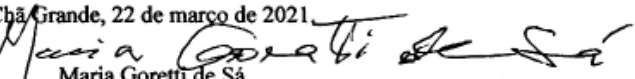

<!-- figure p13-fig1 | described_by: agy | ocr_overlap: None | needs_review: false -->
**(1) Tipo de figura:**
Trata-se de um recorte de documento formal contendo o fecho de datação e um campo de assinatura (datilografado e manuscrito).

**(2) Texto visível (verbatim):**
- Linha superior (texto digitado): `Chã Grande, 22 de março de 2021.`
- Linha intermediária (assinatura manuscrita cursiva): `Maria Goretti de Sá`
- Linha inferior (texto digitado): `Maria Goretti de Sá`

**(3) Estrutura:**
- A imagem não possui caixas, setas, eixos, colunas ou painéis.
- A composição é organizada verticalmente em três níveis:
  - **Nível superior:** Linha alinhada à esquerda com o local e a data.
  - **Nível intermediário:** Assinatura manuscrita em traçado cursivo contínuo, cuja haste inicial da letra "M" estende-se para cima sobrepondo-se parcialmente à palavra "Chã" da linha superior.
  - **Nível inferior:** Linha de texto impresso centralizada logo abaixo da assinatura manuscrita, identificando o nome da signatária.

**(4) Números ou valores de dados:**
- Dia: `22`
- Ano: `2021`

**(5) Cores:**
- A imagem é monocromática (preto sobre fundo branco), sem cores que carreguem significado semântico específico.

~~~text ocr
rande,
Ae C4
~~~

Maria Goretti de Sá Presidenta

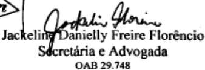

<!-- figure p13-fig2 | described_by: agy | ocr_overlap: 1.0 | needs_review: false -->
**(1) Tipo de figura:**
Trata-se de um recorte de bloco de identificação e assinatura profissional/jurídica extraído de um documento, contendo texto impresso, uma assinatura manuscrita sobreposta e um fragmento gráfico recortado na extremidade esquerda.

**(2) Todo o texto visível (verbatim):**
- Fragmento na extremidade esquerda: `r` (caractere em itálico dentro de uma forma geométrica)
- Assinatura manuscrita (cursiva): `Jackeline Florêncio`
- Texto tipográfico (linha 1): `Jackeline Danielly Freire Florêncio`
- Texto tipográfico (linha 2): `Secretária e Advogada`
- Texto tipográfico (linha 3): `OAB 29.748`

**(3) Estrutura:**
- **Margem esquerda:** Linha vertical divisória. À esquerda dessa linha, há um vértice/borda de um losango contendo a letra *r*.
- **Área principal:**
  - Assinatura manuscrita cursiva em tinta preta disposta na parte superior e cruzando verticalmente o início do texto impresso.
  - Três linhas de texto impresso/digitado dispostas verticalmente e centralizadas entre si:
    - Linha superior: Nome completo da profissional em fonte serifada e negrito.
    - Linha intermediária: Cargos/funções ("Secretária e Advogada").
    - Linha inferior: Identificação do número de inscrição profissional ("OAB 29.748").

**(4) Números e valores de dados:**
- `29.748` (número do registro profissional na Ordem dos Advogados do Brasil - OAB).

**(5) Cores:**
- Imagem monocromática (preto e branco / escala de cinza de digitalização), sem uso de cores que carreguem significado semântico específico.

~~~text ocr
>| .
Jac Freire Florêncio
retária e Advogada
OAB 29.748
~~~

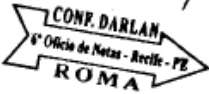

<!-- figure p13-fig3 | described_by: agy | ocr_overlap: None | needs_review: false -->
1. **Tipo de figura:**
Trata-se de uma imagem monocromática de um carimbo ou chancela notarial (selo/marcação de cartório) em formato estilizado de seta horizontal apontando para a direita, contendo inscrições textuais em seu interior e em suas margens superior e inferior.

2. **Texto visível (verbatim):**
* **Acima da seta (no ressalto superior):** `CONF. DARLAN`
* **Dentro do corpo da seta:** `6º Ofício de Notas - Recife - PE`
* **Abaixo da seta:** `ROMA`
* **Canto superior direito:** Um traço/risco diagonal (`/`) isolado.

3. **Estrutura:**
* **Contorno e geometria da seta:**
  * **Cauda (esquerda):** Extremidade com recorte interno em "V" (formato de cauda de andorinha/fita).
  * **Borda superior:** Apresenta uma elevação/aba retangular que contorna o texto superior (`CONF. DARLAN`), descendo em seguida para a linha principal da haste da seta.
  * **Corpo/Haste:** Faixa horizontal delimitada pelas linhas de contorno superior e inferior, abrigando o texto do cartório.
  * **Ponta (direita):** Ponta de seta triangular clássica direcionada para a direita.
  * **Borda inferior:** Linha reta horizontal contínua conectando a ponta à cauda.
* **Disposição dos textos:**
  * `CONF. DARLAN`: Posicionado na parte superior, emoldurado pelo ressalto da linha de contorno, em letras maiúsculas com tipografia condensada.
  * `6º Ofício de Notas - Recife - PE`: Centralizado longitudinalmente no interior do corpo da seta, em fonte inclinada (itálico).
  * `ROMA`: Localizado externamente, centralizado logo abaixo da linha inferior da seta, em caixa alta e fonte com serifa espessa em negrito.
  * No canto superior direito, há uma pequena marcação linear inclinada avulsa.

4. **Números e valores de dados:**
* `6º` (numeral ordinal masculino referindo-se ao "6º Ofício de Notas").

5. **Cores:**
* A imagem é monocromática (preto sobre fundo branco), sem variação cromática com significado semântico.

~~~text ocr
f
CONF
~~~

<!-- page 14 -->

6° OFÍCIO DE NOTAS DE RECIFE - PE.CARTÓRIO ROMA

DANTEYLY

Reconheço por semajhança a firma de: JACKELIME

FLORENCIO Em test da verdade,

FU         S1

Selo:0077248.JDW03202105.04870

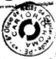

<!-- figure p14-fig1 | described_by: agy | ocr_overlap: None | needs_review: false -->
1. **Tipo de figura:**
Trata-se da reprodução/digitalização de um carimbo circular notarial (selo/chancela de cartório), impresso em preto e branco sobre papel, contendo inscrições textuais dispostas em trajetórias circulares concêntricas, um símbolo gráfico no núcleo central e fragmentos de texto do documento original cortados ao redor da borda externa superior.

2. **Todo o texto visível (verbatim):**
- **Texto do anel circular externo (em sentido horário):**
  `• 6º Ofício de Notas da Capital Recife • PE • •` (a palavra `Notas` encontra-se parcialmente encoberta por uma mancha de tinta preta na borda superior).
- **Texto do anel circular interno:**
  - Arco superior: `CARTÓRIO`
  - Arco inferior: `ROMA`
- **Texto fora do carimbo (margem superior externa):**
  - Fragmento de linha horizontal acima do carimbo: `[ilegível]`
  - Fragmento no canto superior esquerdo: `[ilegível]`
- **Marcação sobreposta:**
  - Traço fino curvilíneo (rubrica/sinal gráfico) sobreposto na lateral direita entre as letras `O` e `Capital`.

3. **Estrutura:**
- **Contorno externo:** Linha circular contínua fina delimitando o carimbo.
- **Camada textual externa:** Faixa anelar periférica contendo o texto `6º Ofício de Notas da Capital Recife • PE`, com o topo das letras voltado para a borda externa e separado por pequenos pontos/marcadores.
- **Camada textual interna:** Faixa anelar intermediária contendo a identificação `CARTÓRIO` (na metade superior) e `ROMA` (na metade inferior), ambas com a base voltada para o centro.
- **Núcleo central:** Emblema/logotipo circular composto por dois arcos semicirculares espessos em preto, com pontas chanfradas/cortadas em diagonal, envolvendo um centro circular branco vazio.
- **Irregularidades e sobreposições:** 
  - Borrão de tinta densa na porção superior central sobrepondo a borda externa e a inscrição `Notas`.
  - Traço de caneta/rubrica sobreposto no quadrante direito.
  - Linha de texto cortada pertencente ao documento de origem tangenciando o topo do carimbo.

4. **Números e valores de dados:**
- `6º` (número cardinal 6 com indicador ordinal masculino).

5. **Cores:**
- Monocromática (tinta preta sobre fundo branco), com variações tonais decorrentes da pressão do carimbo e do processo de digitalização/escaneamento, sem uso de cores com valor semântico ou diferencial.

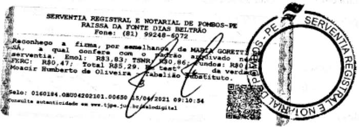

<!-- figure p14-fig2 | described_by: agy | ocr_overlap: 0.89 | needs_review: false -->
### 1. Tipo de figura
Trata-se de uma imagem/digitalização em preto e branco de uma etiqueta cartorária de reconhecimento de firma por semelhança com selo digital de fiscalização (Serventia Registral e Notarial de Pombos - PE, Brasil), contendo cabeçalho do cartório, texto de certificação notarial, discriminação de taxas/emolumentos, assinatura/rubrica manuscrita sobreposta, carimbo circular oficial, código de selo digital, data, horário, endereço eletrônico de validação e um código QR (*QR Code*).

---

### 2. Texto visível (transcrição literal)

* **Cabeçalho (superior centralizado):**
  * `SERVENTIA REGISTRAL E NOTARIAL DE POMBOS-PE`
  * `RAISSA DA FONTE DIAS BELTRÃO`
  * `Fone: (81) 99248-6072`

* **Corpo do texto de autenticação:**
  * `Reconheço a firma, por semelhança de MARIA GORETTI [illegible]`
  * `SÁ, a qual confere com o padrão arquivado nesta`
  * `serventia. Emol: R$3,83; TSNR: R$0,86; Fundos: R$0,13;`
  * `FERC: R$0,47; Total R$5,29. Em test° [illegible] da verdade.`
  * `Moacir Humberto de Oliveira - Tabelião Substituto.`

* **Carimbo circular (texto em arco entre as bordas concêntricas à direita):**
  * `SERVENTIA REGISTRAL E NOTARIAL DE POMBOS - PE`

* **Rodapé (autenticação digital e consulta):**
  * `Selo: 0160184.OBU04202101.00650 15/04/2021 09:10:54`
  * `Consulte autenticidade em www.tjpe.jus.br/selodigital`

---

### 3. Estrutura

* **Formato geral:** Etiqueta adesiva retangular horizontal com fundo claro.
* **Margem esquerda:** Faixa vertical decorativa/de segurança com padrão gráfico tipo guilhoché.
* **Faixa vertical de segurança (à direita):** Faixa vertical com textura/padrão de segurança cortando o terço direito da etiqueta.
* **Carimbo circular:** Localizado sobre a extremidade direita da etiqueta, formado por dois círculos concêntricos pretos contendo a inscrição da serventia ao longo da borda circular; o carimbo sobrepõe levemente o final das linhas de texto e a faixa de segurança vertical.
* **Assinatura manuscrita / Rubrica:** Traçado curvilíneo manuscrito a caneta/tinta escura, posicionado no centro-direita, sobrepondo verticalmente as linhas do texto impresso e estendendo-se até o interior do carimbo circular.
* **Código QR (*QR Code*):** Localizado no canto inferior direito, posicionado abaixo do texto principal e à esquerda do bordo inferior do carimbo circular.
* **Disposição do conteúdo textual:**
  * Topo: Identificação institucional e contato.
  * Meio: Declaração de fé pública de reconhecimento de firma, discriminação de custas e identificação do signatário (Tabelião Substituto).
  * Base: Identificação do selo digital, data/hora da emissão e instruções de consulta de autenticidade no portal do Tribunal de Justiça de Pernambuco (TJPE).

---

### 4. Números e valores de dados

* **Telefone:** `(81) 99248-6072` (código de área `81`, número `99248-6072`)
* **Valores monetários / Taxas:**
  * `Emol` (Emolumentos): `R$3,83`
  * `TSNR` (Taxa de Serviços Notariais e Registrais): `R$0,86`
  * `Fundos`: `R$0,13`
  * `FERC` (Fundo Especial do Registro Civil): `R$0,47`
  * `Total`: `R$5,29`
* **Código do Selo Digital:** `0160184.OBU04202101.00650`
* **Data da emissão:** `15/04/2021` (15 de abril de 2021)
* **Horário da emissão:** `09:10:54` (09 horas, 10 minutos e 54 segundos)

---

### 5. Cores

A imagem é monocromática (preto, branco e tons de cinza resultantes de digitalização/escaneamento em alto contraste), não havendo cores cromáticas com significado funcional ou semântico específico.

~~~text ocr
SERVENTIA REGISTRAL E NOTAR
DE ve
RAISSA DA FONTE DIAS
Fone: (81) 99248-6972
~~~

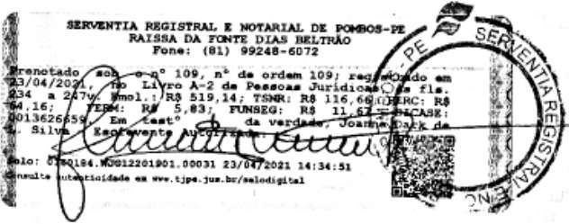

<!-- figure p14-fig3 | described_by: agy | ocr_overlap: 0.86 | needs_review: false -->
**(1) Tipo de figura:**
Trata-se de uma etiqueta/certidão retangular de autenticação, prenotação e registro cartorário (selo/etiqueta de serventia registral e notarial brasileira), contendo texto impresso, discriminação de emolumentos e taxas, assinatura manuscrita sobreposta, código QR e carimbo circular oficial da serventia.

**(2) Texto visível (verbatim):**
* **Cabeçalho:**
  `SERVENTIA REGISTRAL E NOTARIAL DE POMBOS-PE`
  `RAISSA DA FONTE DIAS BELTRÃO`
  `Fone: (81) 99248-6072`

* **Corpo do texto:**
  `Prenotado sob o nº 109, nº de ordem 109; registrado em`
  `23/04/2021, no Livro A-2 de Pessoas Jurídicas às fls.`
  `234 a 247v. Emol.: R$ 519,14; TSNR: R$ 116,66; FERC: R$`
  `64,16; FERM: R$ 5,83; FUNSEG: R$ 11,67; DICASE:`
  `0013626659. Em testº da verdade, Joanna Dark de`
  `L. Silva Escrevente Autorizada.`

* **Rodapé (Selo Digital):**
  `Selo: 0180184.WUG12201901.00031 23/04/2021 14:34:51`
  `Consulte autenticidade em www.tjpe.jus.br/selodigital`

* **Carimbo circular (arco da borda):**
  `- PE SERVENTIA REGISTRAL E NO[illegible]`

**(3) Estrutura:**
* **Formato geral:** Retângulo horizontal emoldurado em suas extremidades laterais (esquerda e direita) por barras verticais com padrões gráficos decorativos de segurança (guilloché).
* **Cabeçalho:** Centralizado no topo com 3 linhas (nome da serventia, nome da responsável/tabeliã e telefone).
* **Bloco central:** Texto alinhado à esquerda/justificado com 6 linhas contendo a descrição do ato de registro, livro, folhas, discriminação dos valores e a fórmula de encerramento da escrevente autorizada.
* **Assinatura:** Rubrica/assinatura manuscrita fluida contínua sobreposta às linhas 5 a 9 no quadrante inferior esquerdo/central.
* **Carimbo circular:** Posicionado no canto superior direito, sobrepondo parcialmente o texto e a barra decorativa direita, contendo um elemento gráfico estilizado na parte superior interna e texto ao longo da borda circular.
* **Código QR:** Localizado no canto inferior direito, abaixo do carimbo circular.
* **Rodapé:** Duas linhas na parte inferior contendo os dados do selo digital (código, data e hora) e a instrução de consulta com o endereço eletrônico do TJPE.
* **Linha divisória:** Há uma linha horizontal fina contínua atravessando o terço inferior do documento.

**(4) Números e valores de dados:**
* **Telefone:** (81) 99248-6072
* **Número da prenotação:** 109
* **Número de ordem:** 109
* **Data do registro:** 23/04/2021
* **Livro:** A-2
* **Folhas:** 234 a 247v
* **Emolumentos (Emol.):** R$ 519,14
* **TSNR:** R$ 116,66
* **FERC:** R$ 64,16
* **FERM:** R$ 5,83
* **FUNSEG:** R$ 11,67
* **DICASE:** 0013626659
* **Código do Selo Digital:** 0180184.WUG12201901.00031
* **Data e hora do selo digital:** 23/04/2021 14:34:51

**(5) Cores:**
A imagem apresenta-se inteiramente em preto e branco (escala de cinza decorrente de digitalização monocromática de documento impresso). Não há cores com significado semântico específico.

~~~text ocr
SERVENTIA REGISTRAL E NOTARIAL DE POMBOS-PE
RAISSA DA FONTE DIAS BELTRAO
Fone: (81) 99248-6072
109, nº de ordem 109;
D de Pessoas
Ú 24:34:52
os Cipe. tal
~~~

FREIRE

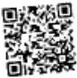

<!-- figure p14-fig4 | described_by: agy | ocr_overlap: None | needs_review: false -->
### 1. Kind of Figure
The image is a 2D matrix barcode, specifically a standard square **QR code** (Quick Response Code).

---

### 2. Visible Text
There is **no visible human-readable text** in the image (no titles, labels, legends, captions, axis ticks, or cell values).

---

### 3. Structure
- **Overall Layout**: A single square panel comprising a two-dimensional grid of black and white modules (binary pixel matrix).
- **Position Detection Patterns (Finder Patterns)**: Three prominent concentric square markers located at three corners:
  - Top-left corner
  - Top-right corner
  - Bottom-left corner  
  Each finder pattern consists of an outer black square frame surrounding a white space, which in turn encloses a solid black center square.
- **Alignment Pattern**: A smaller concentric square alignment pattern located towards the lower-right quadrant.
- **Timing and Data Modules**: Alternating and clustered black and white squares distributed across the grid containing timing patterns, format information, error correction, and encoded data.
- **Connectors / Flow Elements**: No boxes, arrows, lines of connection, axes, or multi-panel layouts are present.

---

### 4. Numbers and Data Values
There are **no explicit numerical labels or data values** displayed in the figure.

---

### 5. Colours and Meaning
- **Black and White**: Purely monochromatic / binary. Black modules represent binary 1s (dark modules) and the white background/modules represent binary 0s (light modules).
- Subtle grayscale antialiasing/blur appears around the edges of the modules due to raster extraction resolution.

I
