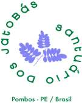
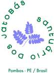
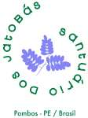
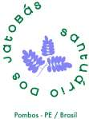
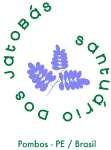
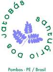
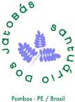

<!-- page 1 -->

<!-- figure p01-fig1 | described_by: agy | ocr_overlap: None | needs_review: false -->
**(1) Tipo de figura:**
Trata-se de um logotipo / emblema gráfico circular (marca/selo) composto por uma ilustração botânica central estilizada, texto em arco ao redor da ilustração e um subtítulo horizontal de localização na base.

**(2) Todo o texto visível (verbatim):**
- Texto disposto em arco circular (lido no sentido horário):
  `santuário Dos Jatobás`
  (sendo individualmente: `santuário`, `Dos`, `Jatobás`)
- Texto horizontal na base inferior:
  `Pombos - PE / Brasil`

**(3) Estrutura:**
- **Centro:** Ilustração botânica estilizada composta por três ramos/folhas compostas (folíolos de jatobá) conectados a um eixo central fino. Um ramo aponta verticalmente para cima, outro para a esquerda e o terceiro para a direita.
- **Periferia circular:** O texto `santuário Dos Jatobás` envolve o centro formando uma moldura quase circular, com as letras orientadas ao longo da curvatura (o topo das letras voltado para o centro da imagem). O texto se inicia na lateral superior direita com `santuário`, passa pela base inferior esquerda com `Dos` e sobe pela lateral esquerda até o topo com `Jatobás`.
- **Base:** Uma única linha de texto horizontal (`Pombos - PE / Brasil`), centralizada logo abaixo da composição circular.
- **Painéis, caixas, eixos e conectores:** Não há caixas, setas, eixos, tabelas, painéis, linhas de grade ou conectores.

**(4) Números e valores de dados:**
Não há nenhum número, valor numérico, data ou dado estatístico presente na imagem.

**(5) Cores:**
- **Verde-escuro / verde-folha:** Aplicado em todo o conteúdo tipográfico (`santuário Dos Jatobás` e `Pombos - PE / Brasil`), remetendo à natureza e vegetação.
- **Lilás / azul-arroxeado suave:** Aplicado na ilustração botânica central (folhas e hastes).
- **Branco:** Cor do fundo liso da imagem.

~~~text ocr
do
2
>
Q
Pombos - PE / Brasil
~~~

## REGIMENTO INTERNO DA ASSOCIAÇÃO ECOVILA SANTUÁRIO DOS JATOBÁS

( v13 - Aprovado AGO - 21Jan2024 )

## ÍNDICE

1. NOSSOS FUNDAMENTOS (Manifesto da Associação)
- 1.1 Quem Somos
- 1.2 Nossos Princípios
- 1.3 Nossa Essência
- 1.4 Nossos Pilares
2. NOSSOS ASSOCIADOS E SEUS DIREITOS E DEVERES
- 2.1 Direito Geral de Admissão
- 2.2 Associados Fundadores
- 2.3 Associados Pioneiros
- 2.4 Associados Titulares
- 2.4.1 Direito a área privativa
- 2.4.2 Direito de convocar assembleias
- 2.4.3 Direito de participar e de votar
- 2.4.4 Direito de ser votado
- 2.4.5 Direito de se fazer representar
- 2.4.6 Direito de sucessão
- 2.5 Associados Voluntários
- 2.6 Admissão de Associados Titulares
- 2.7 Exclusão do Associado Voluntário
- 2.8 Exclusão do Associado Titular
- 2.9 Deveres dos Associados
22. 3 NOSSO MODELO DE ORGANIZAÇÃO E GESTÃO
- 3.1 Decisões colegiadas
- 3.2 Grupos e Comissões Técnicas
- 3.3 Compromisso com o Desenvolvimento das Pessoas
- 3.4 Compromisso com a Transparência da Gestão
- 3.5 Atenção aos Requisitos Legais para as Organizações do Terceiro Setor
28. 4 COMO DISCUTIMOS E RESOLVEMOS NOSSOS CONFLITOS
- 4.1 Diálogo Aberto e Continuado
- 4.2 Comissão de Mediação de Conflitos
- 4.3 Procedimentos para Responsabilização dos Associados

<!-- page 2 -->

a

<!-- figure p02-fig1 | described_by: agy | ocr_overlap: None | needs_review: false | decorative: true -->
1. **Tipo de figura:**
Trata-se de um logotipo ou emblema institucional/gráfico circular (marca nominativa e figurativa).

2. **Texto visível (ipsis verbis):**
* Texto disposto em formato circular (ao redor do elemento central):
  `santuário Dos JatoBás`
* Texto horizontal (centralizado na base):
  `Pombos - PE / Brasil`

3. **Estrutura:**
* **Elemento central:** Ilustração estilizada de folhagem/ramagem composta (três folhas ou ramos pinados agrupados e conectados a uma haste/caule central).
* **Arranjo do texto circular:** As palavras envolvem o elemento central formando uma circunferência:
  * `santuário` inicia no quadrante superior direito e desce pela lateral direita;
  * `Dos` posiciona-se na parte inferior da curva;
  * `JatoBás` segue pelo lado esquerdo curvando-se em direção ao topo.
* **Elemento inferior:** Uma única linha horizontal de texto localizada logo abaixo da composição circular, indicando o município, unidade federativa e país.
* **Outros elementos estruturais:** Não há caixas, setas, eixos, linhas de grade, colunas, tabelas ou painéis.

4. **Números ou valores de dados:**
Não há números ou dados quantitativos na imagem.

5. **Cores:**
* **Verde escuro / verde-floresta:** Aplicado em todos os textos (`santuário Dos JatoBás` e `Pombos - PE / Brasil`).
* **Lilás / azul-violáceo / lavanda:** Aplicado na ilustração central dos ramos e folhagens.
* **Branco / transparente:** Cor do fundo.

~~~text ocr
6°
2
So
+
Pombos - PE / Brasil
~~~

| 4.4    | Procedimentos para Responsabilização dos Administradores           | Procedimentos para Responsabilização dos Administradores           |
|--------|--------------------------------------------------------------------|--------------------------------------------------------------------|
| 4.5    | Penas de Responsabilização                                         | Penas de Responsabilização                                         |
| 5      | COMO ORGANIZAMOS OS RECURSOS PATRIMONIAIS E FINANCEIROS            | COMO ORGANIZAMOS OS RECURSOS PATRIMONIAIS E FINANCEIROS            |
| 5.1    | Fontes de Receita                                                  | Fontes de Receita                                                  |
|        | 5.1.1                                                              | Sustentabilidade                                                   |
|        | 5.1.2                                                              | Vendas de Títulos Patrimoniais                                     |
|        | 5.1.3                                                              | Pagamentos dos Títulos Patrimoniais                                |
|        | 5.1.4                                                              | Atraso no pagamento de Título Patrimonial                          |
|        | 5.1.5                                                              | Taxa de Adesão                                                     |
|        | 5.1.6                                                              | Contribuições dos Associados                                       |
|        | 5.1.7                                                              | Atualização de Valores                                             |
|        | 5.1.8                                                              | Doações, Subvenções ou Legados                                     |
|        | 5.1.9                                                              | Remuneração na Comercialização de Produtos e Serviços              |
| 5.2    | Utilização de Recursos                                             | Utilização de Recursos                                             |
|        | 5.2.1                                                              | Despesas                                                           |
|        | 5.2.2                                                              | Investimentos                                                      |
| 5.3    | Alteração Patrimonial                                              | Alteração Patrimonial                                              |
| 6.     | COMO ORGANIZAMOS NOSSA INFRAESTRUTURA E NOSSAS MORADIAS            | COMO ORGANIZAMOS NOSSA INFRAESTRUTURA E NOSSAS MORADIAS            |
| 6.1    | Usufruto de Áreas de Uso Comum                                     | Usufruto de Áreas de Uso Comum                                     |
| 6.2    | Planejamento e Desenvolvimento das Áreas de Uso Comum              | Planejamento e Desenvolvimento das Áreas de Uso Comum              |
| 6.3    | Garantia de Área Privativa Correspondente ao Título Adquirido      | Garantia de Área Privativa Correspondente ao Título Adquirido      |
| 6.4    | Alteração da Dimensão da Área Privativa                            | Alteração da Dimensão da Área Privativa                            |
| 6.5    | Localização da Área Privativa                                      | Localização da Área Privativa                                      |
| 6.6    | Edificação na Área Privativa                                       | Edificação na Área Privativa                                       |
| 6.7    | Autorização para Edificação                                        | Autorização para Edificação                                        |
| 6.8    | Requisitos para as Construções Coletivas e Privativas              | Requisitos para as Construções Coletivas e Privativas              |
| 6.9    | Alienação de Título Patrimonial                                    | Alienação de Título Patrimonial                                    |
| 7.     | NOSSOS ACORDOS TRANSITÓRIOS ATÉ A ENTRADA EM VIGOR DESTE REGIMENTO | NOSSOS ACORDOS TRANSITÓRIOS ATÉ A ENTRADA EM VIGOR DESTE REGIMENTO |
| 7.1    | Os Associados Pioneiros                                            | Os Associados Pioneiros                                            |
| 7.2    | O Conselho Diretor                                                 | O Conselho Diretor                                                 |
| 7.3    | Os Associados Titulares                                            | Os Associados Titulares                                            |
|        | Colegiados e os Casos Omissos                                      | Colegiados e os Casos Omissos                                      |
| 8. 8.1 | COMO                                                               | TRATAMOS OS CASOS OMISSOS DESSE REGIMENTO                          |

\_\_\_\_\_\_\_\_\_\_\_\_\_\_\_\_\_\_\_\_\_\_\_\_\_\_\_\_\_\_\_\_\_\_\_\_\_\_\_\_\_\_\_\_\_\_\_\_\_\_\_\_\_\_\_\_\_\_\_\_\_\_\_\_\_\_\_\_\_\_\_

<!-- page 3 -->

<!-- figure p03-fig1 | described_by: agy | ocr_overlap: None | needs_review: false -->
1. **Tipo de figura:**
Trata-se de um logotipo / emblema circular (logomarca) estilizado de identificação institucional/ambiental.

2. **Texto visível (verbatim):**
- Texto disposto em formato circular ao redor do centro (no sentido horário):
  `santuário Dos Jatobás`
- Texto horizontal abaixo da composição circular:
  `Pombos - PE / Brasil`

3. **Estrutura:**
- **Centro:** Ilustração botânica estilizada composta por três folhas/hastes compostas pinadas com vários pares de folíolos pequenos, dispostas a partir de ramos finos centrais (uma folha apontando para cima, uma para a esquerda e uma para a direita).
- **Borda / Anel de texto:** O texto `santuário Dos Jatobás` envolve a ilustração central formando um círculo, com a base das letras voltada para o centro da imagem: a palavra `santuário` ocupa a lateral direita e inferior direita, `Dos` fica na parte inferior/inferior esquerda e `Jatobás` sobe pela lateral esquerda até o topo.
- **Base:** Abaixo do círculo formado pelo texto, há uma linha horizontal centralizada com a localização `Pombos - PE / Brasil`.
- A figura não contém caixas delimitadoras, setas, eixos cartesianos, linhas, colunas ou divisão em painéis.

4. **Números e valores de dados:**
Não há nenhum número ou dado numérico presente na imagem.

5. **Cores:**
- **Verde escuro:** Aplicado em todos os textos (`santuário Dos Jatobás` e `Pombos - PE / Brasil`), remetendo à identidade ecológica/natureza.
- **Lilás / violeta claro:** Utilizado na ilustração botânica dos ramos e folhas no centro.
- **Branco:** Cor de fundo da imagem.

~~~text ocr
+
Pombos - PE / Brasil
~~~

## 1 NOSSOS FUNDAMENTOS (Manifesto da Associação)

- 1.1 Quem Somos. A ECOVILA SANTUÁRIO DOS JATOBÁS é um espaço de cuidado coletivo, cultivo de valores fraternais, amorosos, solidários e de resgate e criação de parâmetros comunitários horizontais, sustentáveis, justos e harmoniosos, entre si e com o entorno, nos termos do seu Estatuto e deste Regimento Interno.
- 1.2 Nossos Princípios. Estamos alinhados com princípios de sustentabilidade ambiental, social, cultural, econômica e ecológica, tendo como objetivos implantar tecnologias limpas, cultivar a responsabilidade ambiental e recuperação do solo a partir de técnicas de reflorestamento. Nesse ambiente vamos viver mais próximas do ambiente natural e com um contato mais amigável junto aos vizinhos. Privilegiamos o espaço público em detrimento do individual, assim como o pedestre e o ciclista, em detrimento de veículos automotores, minimizando o tráfego e contribuindo para um ambiente saudável, de silêncio e contemplação.
- 1.3 Nossa Essência. O espírito é o da convivência harmônica e colaborativa entre os associados e a comunidade ao redor, preservação da flora e fauna num molde das comunidades tradicionais, cocriando e se adaptando, escapando de quaisquer pretensões de atividades especulativas sobre a terra.

## 1.4 Nossos Pilares

- INCLUSÃO: Proporcionar para os nossos Associados e suas famílias um retorno a terra, raciocinando a partir de uma nova visão de territorialidade e de propriedade, quebrando a ilusão de separação gerada pelo materialismo, a concentração de renda e as desigualdades sociais, construindo um padrão mais amoroso e maduro de equalização das diferenças, opiniões, crenças e religiões. Desestimular quaisquer preconceitos de gênero, religião, raça, cor, orientação sexual, e misoginia historicamente criadas.
- INSPIRAÇÃO: Honrar e celebrar as raízes indígenas nativas do nosso país e continente, Tupis, Guaranis, Maias, Incas, Asteca, Quilombos e outros que não sabemos nomear, aprendendo e exercitando formato de convivência harmônica com a natureza, suas cosmovisões espirituais e de medicina, astrologia e tantas outras faculdades intelectuais e biológicas das nossas comunidades tradicionais. Esses conceitos viscerais são unidos à novas técnicas e tecnologias de permacultura, agricultura biodinâmica, bioconstrução, geofísica, organização sistêmica e ecologia profunda, a fim de promover um baixo impacto ambiental, gestão consciente e sustentável de resíduos e dejetos, ocupação e uso respeitoso da terra.
- REGENERAÇÃO: Entendendo que estamos em transição e que o modelo desenvolvimentista concentrador de renda e destruidor de nossos recursos naturais não responde às necessidades humanas e planetárias, nossa Ecovila busca consertar vários equívocos de estruturas que não nos servem mais nessa caminhada de evolução da consciência e transição planetária, criando caminhos de auto cuidado, de retratação aos povos primordiais e à Mãe Terra, entendendo que cabe a cada um se olhar e identificar

\_\_\_\_\_\_\_\_\_\_\_\_\_\_\_\_\_\_\_\_\_\_\_\_\_\_\_\_\_\_\_\_\_\_\_\_\_\_\_\_\_\_\_\_\_\_\_\_\_\_\_\_\_\_\_\_\_\_\_\_\_\_\_\_\_\_\_\_\_\_\_

<!-- page 4 -->

<!-- figure p04-fig1 | described_by: agy | ocr_overlap: None | needs_review: false -->
**(1) Tipo de figura**
Trata-se de um logotipo / emblema circular (logomarca) de identidade visual.

**(2) Texto visível (verbatim)**
* **Texto em disposição circular (no sentido horário):**
  * `santuário`
  * `Dos`
  * `jatobás`
  *(formando a frase: `santuário Dos jatobás` ou `jatobás santuário Dos`)*
* **Texto horizontal inferior:**
  * `Pombos - PE / Brasil`

**(3) Estrutura**
* **Composição geral:** O logotipo possui formato circular com ilustração central e texto contornando o perímetro, além de uma legenda geográfica horizontal logo abaixo.
* **Elemento central:** Ilustração estilizada em silhueta de folhagem/ramo composto (três conjuntos de folíolos ramificados a partir de uma haste comum: um voltado para o topo, um para a esquerda e um para a direita).
* **Elemento periférico (em círculo):** O texto contorna a ilustração no sentido horário com as letras voltadas para fora:
  * `santuário` ocupa a lateral direita (aproximadamente entre 1h30 e 5h30);
  * `Dos` ocupa a parte inferior esquerda (aproximadamente entre 6h30 e 8h30);
  * `jatobás` ocupa a lateral esquerda e o topo (aproximadamente entre 9h00 e 12h30).
* **Elemento inferior:** Texto linear centralizado horizontalmente abaixo da base do círculo (`Pombos - PE / Brasil`).
* **Conexões e divisões:** Não há caixas, setas, eixos, painéis múltiplos, linhas de grade ou tabelas.

**(4) Números e valores de dados**
Não há números, gráficos de dados, eixos ou valores quantitativos presentes na figura.

**(5) Cores**
* **Fundo:** Branco.
* **Textos:** Verde-escuro (tanto no anel circular quanto na linha inferior).
* **Ilustração central:** Lavanda / lilás / azul-púrpura suave.

~~~text ocr
c
+
Pombos - PE / Brasil
~~~

- em si os aspectos que precisam ser curados, principalmente ligados a insegurança, ao julgamento e ao medo.
- RESSURREIÇÃO: Todos os dias o Universo nos proporciona a oportunidade divina de, com o nosso intransferível livre arbítrio e outras leis da criação, cocriar a todo instante e manifestar ao nosso redor o que acreditamos ser a realidade. Esse conhecimento foi retido por muito tempo a fim de aprisionar esse nosso poder de escolha em tendências pré-moldadas que nos levam a fazer coisas que não queremos, concordamos ou acreditamos. Temos a oportunidade de olhar para isso e nos curar, libertando toda a limitação gerada pelo medo e todo sentimento em sintonia com ele, sofrimento, escassez, desconfiança, egoísmo e vitimização. A partir daí, começaremos a assumir com mais responsabilidade e consciência nossas escolhas e suas consequências, sintonizando nossa vibração com energias mais elevadas, entendendo o processo histórico de dominação de que fomos acometidos durante todos esses anos.
- RENOVAÇÃO: Reavaliar e renovar o necessário para a evolução de formatos diversos (sociais, emocionais, culturais, econômicos etc.) dando acesso direto a qualidades que são naturais (abundância, prosperidade, otimismo, empatia, intuição, telepatia) e que muitas vezes acreditamos ser inatingíveis ou inexistentes. Aprender a viver em abundância com o que possuímos naturalmente. Retirar de nós o incansável exercício de ter cada vez mais e desejar cada vez mais, apenas para satisfazer o ego infantil, querendo concentrar para si ao invés de entrar no fluxo da prosperidade compartilhada.
- SUSTENTABILIDADE: Implementar programas e processos que permitam uma relação harmônica e sustentável com a natureza, especificamente os princípios de Reduzir, Repensar, Recusar, Reciclar e Reutilizar.

## 2 NOSSOS ASSOCIADOS E SEUS DIREITOS E DEVERES

- 2.1 Direito Geral de Admissão. A associação não pode utilizar qualquer critério discriminatório que viole princípios e garantias constitucionais de igualdade e de dignidade da pessoa humana. Assim, não pode impedir a admissão de associado, em razão de sua religião, sua etnia, sua convicção política ou sua orientação sexual.
- 2.2 Associados Fundadores. São considerados Associados Fundadores os presentes ou representados na Assembleia Geral Extraordinária de Fundação, Eleição e Posse da Associação, ocorrida em 22 de março de 2021.
- 2.2.1 Os Associados Fundadores adquirentes de Títulos Patrimoniais, por meio de compra ou doação, têm os mesmos direitos e deveres dos Associados Titulares, conforme descrito nos itens 2.4 e 2.9 deste Regimento.

\_\_\_\_\_\_\_\_\_\_\_\_\_\_\_\_\_\_\_\_\_\_\_\_\_\_\_\_\_\_\_\_\_\_\_\_\_\_\_\_\_\_\_\_\_\_\_\_\_\_\_\_\_\_\_\_\_\_\_\_\_\_\_\_\_\_\_\_\_\_\_

<!-- page 5 -->

<!-- figure p05-fig1 | described_by: agy | ocr_overlap: None | needs_review: false -->
**1. Tipo de figura**
Trata-se de um logotipo / emblema institucional (marca gráfica) de formato circular, contendo uma ilustração botânica central, tipografia em disposição circular ao redor do desenho e uma linha de subtítulo horizontal na parte inferior.

**2. Todo o texto visível (literal/verbatim)**
* Texto em disposição circular (em torno do elemento central):
  * `santuário`
  * `Dos`
  * `Jatobás`
  *(dispostos em arco formando a leitura contínua: "santuário Dos Jatobás")*
* Texto linear horizontal (centralizado na base inferior):
  * `Pombos - PE / Brasil`

**3. Estrutura**
* **Área central:** Ilustração estilizada de um pequeno galho/haste de onde partem três ramos com múltiplos folíolos (folhas compostas/pinadas).
* **Anel/Arco periférico:** Texto disposto em trajetória circular contornando a ilustração central ("santuário" no lado direito curvando para baixo, "Dos" na parte inferior esquerda e "Jatobás" subindo pelo lado esquerdo em direção ao topo).
* **Parte inferior:** Linha de texto única, reta e horizontal, centralizada logo abaixo do arranjo circular, indicando a localidade e o país.
* Não contém caixas, setas, eixos coordenados, linhas/colunas de tabela ou divisões em painéis.

**4. Números ou valores de dados**
Não há números ou dados quantitativos na figura.

**5. Cores**
* **Verde-escuro:** Aplicado em todos os caracteres textuais (`santuário`, `Dos`, `Jatobás` e `Pombos - PE / Brasil`).
* **Lilás / azul-arroxeado claro:** Aplicado no desenho da haste e dos folíolos da planta central.
* **Branco:** Cor do fundo sobre o qual a imagem está aplicada.

~~~text ocr
+
Pombos - PE / Brasil
~~~

- 2.2.2 Em qualquer tempo, caso decida adquirir um Título Patrimonial, o Associado Fundador deve ter seu Pedido de Admissão apresentado diretamente ao Conselho Diretor, entretanto, fica sujeito a disponibilidade de Título Patrimonial à venda.
- 2.3 Associados Pioneiros. São Associados Pioneiros aqueles que idealizaram a concepção e apoiaram financeiramente a Ecovila por meio da aquisição dos primeiros Títulos Patrimoniais, para compra da área total da AESJ, nos termos da Ata de Assembleia Geral Extraordinária, ocorrida em 17 de agosto de 2021, bem como contribuíram com o desenvolvimento de suas atividades.
- 2.4 Associados Titulares. São os proprietários de Título(s) Patrimonial(ais), que tem direito ao usufruto de área privativa, denominada de 'chão', correspondente ao(s) título(s) adquirido(s), cuja especificação consta do Capítulo 6, nas seguintes condições:

## 2.4.1 Direito a área privativa

- (a) Os Associados Titulares podem ser proprietários de até 2 (dois) títulos e respectiva área privativa, independentemente do tamanho do chão correspondente, conforme descrito no Capítulo 6 deste Regimento

## 2.4.2 Direito de convocar assembleias.

- (a) Os Associados Titulares podem convocar Assembleias Gerais Extraordinárias, mediante requerimento dirigido ao Presidente do Conselho Diretor, assinado por, no mínimo, 1/5 (um quinto) dos associados integrantes do quadro, que estejam quites com as obrigações da Associação e no gozo dos direitos que lhes são reconhecidos no Estatuto e neste Regimento.

## 2.4.3 Direito de participar e de votar

- (a) Os Associados Titulares têm o direito de participar das Assembleias Gerais Ordinárias e Extraordinárias, assim como nas demais instâncias de deliberação de tomada de decisões da Associação, e de votar e serem votados para qualquer finalidade dentro da Associação, desde que estejam em dia com todos os seus compromissos financeiros, independentemente do número de títulos.
- (b) Um mesmo Título Patrimonial e respectiva área privativa pode ser de propriedade de até 4 (quatro) Associados Titulares, no entanto, apenas um deles terá direito a voto nas assembleias e nas demais instâncias de deliberação de tomada de decisões da Associação. Na hipótese de mais de um desses Titulares desejar exercer o direito de voto, a prioridade será conforme a ordem de apresentação dos seus nomes no Contrato.
- (c) Ainda que um mesmo Associado Titular seja proprietário de mais de um Título sempre terá direito a apenas um voto nas assembleias e nas demais instâncias de deliberação de tomada de decisões da Associação.

## 2.4.4 Direito de ser votado

- (a) Quando um mesmo título patrimonial pertencer conjuntamente a mais de um associado, todos poderão ser votados, mas apenas 2 (dois) poderão assumir concomitantemente

\_\_\_\_\_\_\_\_\_\_\_\_\_\_\_\_\_\_\_\_\_\_\_\_\_\_\_\_\_\_\_\_\_\_\_\_\_\_\_\_\_\_\_\_\_\_\_\_\_\_\_\_\_\_\_\_\_\_\_\_\_\_\_\_\_\_\_\_\_\_\_

<!-- page 6 -->

<!-- figure p06-fig1 | described_by: None | ocr_overlap: None | needs_review: true | decorative: true -->
[no description]

~~~text ocr
+
Pombos - PE / Brasil
~~~

cargos no Conselho Diretor, e um no Conselho Fiscal, limitado ao total de dois cargos em simultâneo no conjunto dos Conselhos.

## 2.4.5 Direito de se fazer representar

- (a) Caso o Associado Titular esteja impossibilitado de participar de alguma Assembleia ou em qualquer instância de deliberação de tomada de decisões da Associação, poderá se fazer representar por outro sócio titular ou voluntário devidamente credenciado, mediante procuração enviada e recepcionada antes do início da Assembleia, ao Conselho Diretor, por correio eletrônico, sem exigência de reconhecimento cartorial.

## 2.4.6 Direito de sucessão

- (a) O Associado Titular poderá indicar um sucessor, independentemente da ordem de sucessão de herança, por meio de uma declaração expressa de vontade registrada em cartório e entregue à AESJ para ser anexada ao seu Contrato de Aquisição de Título Patrimonial.
- (b) A propriedade de um título por meio de herança deve passar pelo mesmo processo de admissão de Associados Titulares, conforme especificado no subitem "2.6 Admissão de Associados Titulares".
- (c) O Conselho Diretor pode dispensar o herdeiro do período de Associado Voluntário especificado na letra "c" do subitem "2.6 Admissão de Associados Titulares".
- 2.5 Associados Voluntários. São aquelas pessoas que contribuem com trabalho e/ou conhecimento para o desenvolvimento das atividades da Ecovila, podendo ser residentes temporários, visitantes ou candidatos a ingresso na Associação por meio da aquisição de Título Patrimonial, durante um período de avaliação. São requisitos e condições de participação nessa categoria:
- (a) No caso de residentes temporários ou visitantes, pode ser proposta por qualquer dos Associados Titulares, no entanto, a efetiva participação deve ser formalizada em contrato específico, onde sejam descritas as atividades a serem desenvolvidas, a submissão as normas do Estatuto e deste Regimento e, quando for o caso, a remuneração. A participação desse Associado Voluntário só é considerada efetiva e de plenos direitos após aprovação pelo Conselho Diretor e validação em assembleia.
- (b) No caso dos pretendentes a aquisição de Título Patrimonial deve ser formalizado um acordo de cooperação, onde conste a submissão as normas do Estatuto e deste Regimento.
- (c) Ainda que essa categoria de associados não tenha direito a voto nas assembleias e nas demais instâncias de deliberação de tomada de decisões da Associação, pode participar das reuniões dos grupos e comissões técnicas, e das diversas atividades produtivas, culturais e festivas da Associação, além de usufruir dos espaços coletivos, durante o período de vigência do contrato ou acordo.
- 2.6 Admissão de Associados Titulares. Para ser admitido como Associado Titular é necessário atender aos seguintes requisitos:

\_\_\_\_\_\_\_\_\_\_\_\_\_\_\_\_\_\_\_\_\_\_\_\_\_\_\_\_\_\_\_\_\_\_\_\_\_\_\_\_\_\_\_\_\_\_\_\_\_\_\_\_\_\_\_\_\_\_\_\_\_\_\_\_\_\_\_\_\_\_\_

<!-- page 7 -->

<!-- figure p07-fig1 | same image as p05-fig1 -->

- (a) Apresentação ao Conselho Diretor do Pedido de Admissão, através do preenchimento de formulário eletrônico de ingresso, encaminhado via e-mail, com recomendação de 2 (dois) Associados Titulares, em dia com suas obrigações sociais.
- (b) O pedido de admissão e as recomendações dos Associados Titulares devem ser compartilhados pelo Conselho Diretor, por email, com o conjunto dos Associados Titulares.
- (c) Todos os interessados na aquisição de Título Patrimonial da Associação devem atender um período de 3 (três) meses como Associados Voluntário, contados a partir da apresentação do pedido de admissão, antes da assinatura e efetivação da compra do Título, para uma avaliação mútua do efetivo interesse em ingressar na Ecovila.
- (d) Durante esse período de voluntariado, qualquer Associado Titular, em dia com seus compromissos e obrigações, pode apresentar justificativa fundamentada de oposição ao pedido de admissão, que será analisada em assembleia específica.
- (e) Uma vez encerrado o período de avaliação mútua, sem qualquer objeção das partes, a inclusão do pleiteante na categoria de Associado Titular deverá ser submetida à Assembleia Geral para aprovação, por unanimidade.
- i. Se aprovada, estará condicionada a assinatura de Termo de Adesão (TA), a efetivação de depósito de adesão, conforme valor definido no Subitem 4.1.3 deste Regimento e a assinatura de Contrato de Aquisição de Título Patrimonial (ATP). A escolha da localização da área privativa (chão onde poderá construir a sua moradia) está condicionada à quitação integral do valor do pagamento do seu respectivo Título Patrimonial, conforme ATP.
- ii. Na hipótese de reprovação, uma eventual reapresentação da candidatura só poderá ocorrer no prazo mínimo de 06 (seis) meses.
- iii. Caso a aprovação ocorra sem unanimidade, a candidatura pode ser reapresentada em Assembleia subsequente, acrescida de subsídios que visem eliminar eventuais dúvidas da Assembleia ou atender algum requisito específico, como por exemplo repetir o período como voluntário etc.
- 2.7 Exclusão do Associado Voluntário. A exclusão de um Associado Voluntário deve observar os seguintes procedimentos:
- (a) Caso o pretendente à aquisição de Título Patrimonial decida não mais ingressar na Associação, ele deve informar a sua decisão, por escrito, ao Conselho Diretor.
- (b) Na hipótese de a decisão ser da Associação, o Conselho Diretor deve informar, por escrito, ao pretendente, com os motivos que lastrearam tal decisão.
- (c) O descumprimento do Contrato firmado entre a Associação e o Associado Voluntário, por parte deste último, bem como um comportamento que não se coadune com os princípios da Ecovila são razões suficientes para a denúncia do Contrato e exclusão do Associado Voluntário.
- 2.8 Exclusão do Associado Titular. A exclusão de um Associado Titular do quadro da Associação deve atender aos seguintes requisitos e procedimentos:

\_\_\_\_\_\_\_\_\_\_\_\_\_\_\_\_\_\_\_\_\_\_\_\_\_\_\_\_\_\_\_\_\_\_\_\_\_\_\_\_\_\_\_\_\_\_\_\_\_\_\_\_\_\_\_\_\_\_\_\_\_\_\_\_\_\_\_\_\_\_\_

<!-- page 8 -->

<!-- figure p08-fig1 | same image as p04-fig1 -->

- (a) Quando deixar de pagar as contribuições. O(s) Associado(s) Titular(es) que deixar(em) de pagar as contribuições previstas no Estatuto, aprovadas pelo Conselho Diretor e referendadas em Assembleia, podem ser excluídos do quadro da Associação, após utilizados todos os meios de cobrança amigável e todos os esforços de negociações para pagamento. Quando findo o período de 6 (seis) meses de inadimplência, o Conselho Diretor deve enviar ao(s) Associado(s) Titular(es) em dívida, uma notificação extrajudicial de cobrança do valor integral da dívida, com os acréscimos estabelecidos no subitem 5.1.6 deste Regimento. Caso as iniciativas da Associação não levem a solução completa, ou parcial, do problema, a Diretoria Financeira deve emitir um parecer e submetê-lo a Assembleia Geral para decisão final.
- (b) Quando agir contra os fins da Associação. Neste caso, o processo de exclusão do Associado Titular iniciar-se-á por decisão unânime do Conselho Diretor, devendo o associado ser pessoalmente intimado no início do processo de exclusão por meio de carta enviada pelo correio com aviso de recebimento. Da intimação constará a descrição pormenorizada dos motivos que fundamentaram a proposta de exclusão e o prazo para apresentação de sua defesa, que será de 15 (quinze) dias. O associado apresentará defesa escrita contra sua exclusão ao Conselho Diretor, sob pena de confissão dos fatos que fundamentaram a proposta de exclusão. O Conselho Diretor decidirá por unanimidade sobre a exclusão. Da decisão do Conselho Diretor cabe recurso escrito, no prazo de 15 dias à Assembleia Geral para decisão por maioria de 3/4 (três quartos) dos Associados presentes, em sessão de cuja pauta conste a proposta de exclusão. A decisão final da Assembleia Geral, mantendo ou revogando a medida, terá força obrigatória geral e eficácia definitiva.

## 2.9 Deveres dos Associados:

- (a) Respeitar o Estatuto, este Regimento Interno, as deliberações das Assembleias Gerais Ordinárias e Extraordinárias e as decisões colegiadas do Conselho Diretor e do Conselho Fiscal.
- (b) Proteger o ecossistema da Ecovila, particularmente a fauna nativa, evitando a criação de qualquer espécie predadora que não possa ser contida na sua área privativa (chão).
- (c) Respeitar e fazer respeitar as regras de convivência da Ecovila e evitar ações e comportamentos que causem qualquer tipo de poluição, seja ela ambiental, sonora, visual, além de desconforto a qualquer dos Associados.
- (d) Prestar sua efetiva cooperação ao desenvolvimento da Ecovila e ao cumprimento de suas finalidades, nas condições definidas neste Regimento.
- (e) Pagar a Associação, integral e pontualmente, cada parcela relativa à aquisição do seu respectivo Título Patrimonial (área privativa ou chão), bem como as taxas, impostos e contribuições que venham a ser identificadas e aprovadas pelo Conselho Diretor ou em assembleia, para manutenção da Ecovila.
- (f) O(s) Associado(s) Titular(es) respondem por eventuais faltas e danos dos Associados Voluntários a ele vinculados, bem como dos seus dependentes e convidados.

\_\_\_\_\_\_\_\_\_\_\_\_\_\_\_\_\_\_\_\_\_\_\_\_\_\_\_\_\_\_\_\_\_\_\_\_\_\_\_\_\_\_\_\_\_\_\_\_\_\_\_\_\_\_\_\_\_\_\_\_\_\_\_\_\_\_\_\_\_\_\_

<!-- page 9 -->

a

<!-- figure p09-fig1 | described_by: agy | ocr_overlap: None | needs_review: false -->
1. **Tipo de figura:**
Trata-se de um logotipo/emblema (marca gráfica) de temática ambiental/botânica em formato circular.

2. **Texto visível (verbatim):**
- Disposto em formato circular ao redor do centro:
  - `Jatobás`
  - `Dos`
  - `santuário`
- Disposto em linha horizontal na base inferior:
  - `Pombos - PE / Brasil`

3. **Estrutura:**
- **Centro:** Ilustração estilizada de uma folhagem botânica com três ramos compostos de pequenos folíolos conectados a uma haste central.
- **Arco externo:** As palavras "Jatobás", "Dos" e "santuário" estão distribuídas ao longo de uma circunferência invisível envolvendo a ilustração central ("Jatobás" no quadrante superior-esquerdo, "Dos" no quadrante inferior-esquerdo e "santuário" ao longo do lado direito).
- **Base:** Abaixo da composição circular, encontra-se centralizada horizontalmente a linha de texto que indica a localização geográfica.
- Não há caixas, setas, painéis, eixos ou tabelas.

4. **Números ou valores de dados:**
Não constam números ou valores quantitativos na figura.

5. **Cores:**
- **Verde-escuro:** Utilizado em todas as partes textuais (`Jatobás`, `Dos`, `santuário` e `Pombos - PE / Brasil`).
- **Lilás / violeta-claro:** Utilizado na ilustração dos ramos de folhas ao centro.
- **Branco:** Cor do fundo.

~~~text ocr
6°
2
So
+
Pombos - PE / Brasil
~~~

## 3 NOSSO MODELO DE ORGANIZAÇÃO E GESTÃO

- 3.1 Decisões colegiadas. A associação adota um processo decisório colegiado, conforme segue:
2. (a) Assembleia Geral Ordinária ou Extraordinária. É órgão supremo da Associação e deve atender aos seguintes requisitos e procedimentos:
- i. Ser convocada por edital virtual, enviado por e-mail para todos os Associados, duas vezes seguidas, não podendo a primeira publicação distar menos de cinco dias da data fixada para a realização da Assembleia. De forma complementar, como reforço, um edital físico poderá, eventualmente, ser afixado na sede da associação.
- ii. Deliberar em primeira convocação, com, no mínimo, dois terços dos Associados Titulares, ou por seus representantes instituídos por procuração; em segunda convocação, com um terço; e, em terceira convocação, com qualquer número de associados Titulares, quando não for especificado um quórum mínimo diferente para outras decisões. Em qualquer situação deve-se considerar apenas os Associados Titulares que estiverem quites com os compromissos assumidos perante a Associação.
- iii. Constar do edital de convocação da Assembleia Geral, desde logo, o horário das três convocações estatutárias, devendo, entre a segunda e terceira convocação, mediar um prazo mínimo de 01 (uma) hora entre uma convocação e outra.
- iv. Quando os associados participam da Assembleia de forma virtual, devem manter a câmera do equipamento aberta para permitir o registro fotográfico e se inscrever no chat da ferramenta virtual utilizada para a reunião, caso a sua participação seja presencial, deve assinar o livro de presença.
- v. A Assembleia Geral deve ser gravada em meio eletrônico e pode ser coordenada por qualquer Associado Titular, escolhido pelo Conselho Diretor.
- vi. A Assembleia Geral busca deliberar preferencialmente mediante consenso; na sua impossibilidade, delibera-se por maioria simples dos membros presentes.
- vii. A Assembleia Geral Ordinária será realizada segundo calendário previamente aprovado em Assembleia.
- viii. O arquivo com a gravação das Assembleias Gerais Ordinárias deve ser disponibilizado por e-mail, ou através de link, para todos os Associados Titulares, sendo opcional o registro cartorial da Ata, a critério do Conselho Diretor.
- ix. A Assembleia Geral Extraordinária, será convocada pelo Presidente do Conselho Diretor ou por 1/5 (um quinto) dos Associados Titulares em dia com a Associação, mediante pedido escrito e fundamentado, dirigido ao Conselho Diretor. Sua gravação deve ser disponibilizada através de um 'link' a ser enviado por e-mail para todos os Associados Titulares, sendo necessária a edição de Ata para registro cartorial.
- x. No caso de deliberação acerca da dissolução da Associação, a Assembleia Geral Extraordinária deve ser convocada especificamente para este fim por, no mínimo, 2/3 dos Associados Titulares.

\_\_\_\_\_\_\_\_\_\_\_\_\_\_\_\_\_\_\_\_\_\_\_\_\_\_\_\_\_\_\_\_\_\_\_\_\_\_\_\_\_\_\_\_\_\_\_\_\_\_\_\_\_\_\_\_\_\_\_\_\_\_\_\_\_\_\_\_\_\_\_

<!-- page 10 -->

<!-- figure p10-fig1 | same image as p06-fig1 -->

- (b) Conselho Diretor. Este colegiado é formado pelo(a) Presidente, Vice-Presidente e por 3 (três) Diretorias, a saber: Diretor(a) de Secretaria, Diretor(a) Financeira e Diretor(a) de Arquitetura e Infraestrutura. Os membros desse Conselho devem ser eleitos e empossados pela Assembleia Geral, no entanto, ocorrendo vacância de quaisquer das funções eletivas, por renúncia, desligamento ou morte, o Conselho Diretor se reunirá e escolherá outro(a) associado(a) para o exercício até o término do mandato em curso, informando aos demais Associados Titulares em assembleia.
- (c) Conselho Gestor. Este colegiado é formado pelos 5 (cinco) membros do Conselho Diretor em conjunto com os 2 (dois) membros do Conselho Fiscal.
- (d) Os membros dos Conselhos e demais órgãos administrativos da associação não respondem solidariamente perante terceiros por quaisquer obrigações assumidas pela Associação
- 3.2 Grupos e Comissões Técnicas. Para o planejamento, orçamento e execução de suas atividades a Associação pode criar grupos e comissões técnicas temáticas, 'ad-hoc'. Tais grupos se formam por inscrição aberta aos Associados Titulares e sem limite de quantidade. Ainda, disfrutam de autonomia para organizar suas reuniões, presenciais ou virtuais, assim como ações nas áreas da Ecovila. Por outro lado, mantem o conjunto dos Associados Titulares informados sobre suas propostas de atividades por meio das Assembleias ou em outros meios de interação e comunicação, sempre compartilhando anotações de reuniões e planos de ações. Para captação de recursos da Associação devem apresentar planos e orçamentos em reuniões internas com o Conselho Diretor e em Assembleias com os Associados Titulares, para aprovação de prioridades e valores.
- 3.3 Compromisso com o Desenvolvimento das Pessoas. Considerado um valor fundamental para a Ecovila, o desenvolvimento pessoal e coletivo dos Associados e dos moradores do entorno devem ser priorizados pelo Conselho Gestor, por meio do desenvolvimento e apoio a atividades coletivas que integrem e disseminem conhecimentos, tais como palestras, seminários, cursos, oficinas etc., voltadas para os Associados, a comunidade do entorno e o público em geral, nas áreas ecológicas, ambientais e sociais (oficinas, cursos, debates etc.), assim como ações educativas específicas junto à população, aos parceiros e às lideranças locais, inclusive em articulação com os gestores públicos.
- 3.4 Compromisso com a Transparência da Gestão. Considerado um valor básico da boa gestão, devem ser priorizados pelo Conselho Gestor, desenvolvidas ações que visem:
- (a) Informar, orientar e acompanhar os Associados quanto ao cumprimento e respeito ao Estatuto e a este Regimento Interno.
- (b) Disponibilizar sistematicamente em assembleias e por e-mail as informações relevantes da gestão administrativa e financeira, em especial quanto à prestação de contas.
- 3.5 Atenção aos Requisitos Legais para as Organizações do Terceiro Setor. De modo geral, buscamos atender às regras e princípios constitucionais que são aplicáveis a todo o Terceiro Setor devido às características da Ecovila. Assim, devemos ter uma conduta eticamente responsável, o que abrange, por exemplo, os deveres de utilizar os recursos estritamente para

\_\_\_\_\_\_\_\_\_\_\_\_\_\_\_\_\_\_\_\_\_\_\_\_\_\_\_\_\_\_\_\_\_\_\_\_\_\_\_\_\_\_\_\_\_\_\_\_\_\_\_\_\_\_\_\_\_\_\_\_\_\_\_\_\_\_\_\_\_\_\_

<!-- page 11 -->

<!-- figure p11-fig1 | described_by: None | ocr_overlap: None | needs_review: true | decorative: true -->
[no description]

~~~text ocr
+
Pombos - PE / Brasil
~~~

o alcance de nossas finalidades; de atuar de maneira pública e transparente; e de observar critérios imparciais e não discriminatórios na determinação dos beneficiários de sua atuação:

- (a) Quanto à organização e gestão contábil. A Associação deve atender aos termos de organização, direitos e deveres dos associados constantes do Código Civil Brasileiro e, com atenção especial, à Resolução do Conselho Federal de Contabilidade 926/2001, com a alteração dada pela Resolução do Conselho Federal de Contabilidade 966/2003.
- (b) Quanto à gestão fiscal. Apesar das obrigações tributárias serem menores para a Associação, por se tratar de entidade do Terceiro Setor, elas devem ser cumpridas rigorosamente, uma vez que são entidades sem fins lucrativos gozam de alguns benefícios no campo tributário. Assim, é de suma importância o cumprimento de todas as obrigações tributárias acessórias relativas aos tributos dos quais seja contribuinte.
- (c) Quanto à gestão trabalhista. No que tange a posição de empregador, não difere dos demais, tendo que cumprir todas as obrigações trabalhistas já conhecidas dos contabilistas e advogados.

## 4 COMO DISCUTIMOS E RESOLVEMOS NOSSOS CONFLITOS

- 4.1 Diálogo Aberto e Continuado. O diálogo não é um método. É uma espécie de indagação e conversa caracterizada pelo interesse, escuta e respeito. Pode ser alcançado por acordo, pela cultura do grupo, pela prática, por acidente ou por facilitação. Uma comunidade que consegue se autogerir de maneira sábia e sustentável é aquela que domina o diálogo.
2. (a) Diálogo freireano. Na teoria dialógica freireana, os sujeitos se encontram para conhecer e transformar o mundo em colaboração. O diálogo, que é sempre comunicação, funda a colaboração que se realiza entre as pessoas. 'O diálogo é o encontro amoroso dos homens [e mulheres] que, mediatizados pelo mundo, o pronunciam, isto é, o transformam, e transformando-o, o humanizam para a humanização de todos' (Paulo Freire). O diálogo freireano, então, é solidário e amoroso. e o ser humano é visto como ser dialógico, cuja busca de ser mais se efetiva por meio da comunicação com outras pessoas. Nutre-se do amor, da humildade, da esperança, da fé, da confiança, que se configuram em matriz. Por isso, só o diálogo comunica.
3. (b) Relação de empatia. É quando os dois polos do diálogo se ligam assim, com amor, esperança, com fé um no outro, se fazem críticos na busca de algo. Instala-se então uma relação de empatia entre ambos. Só, então, há comunicação. O amor, a humildade e a fé no ser humano fazem do diálogo uma relação horizontal, cuja consequência é a confiança entre os sujeitos. Por fim, no diálogo, há necessidade do pensar crítico para transformar a sociedade e humanizar-se.
4. (c) Compartilhamento. Assim, o diálogo é uma forma de comunicação marcada pela indagação compartilhada em direção a uma maior compreensão, conexão ou possibilidade de

\_\_\_\_\_\_\_\_\_\_\_\_\_\_\_\_\_\_\_\_\_\_\_\_\_\_\_\_\_\_\_\_\_\_\_\_\_\_\_\_\_\_\_\_\_\_\_\_\_\_\_\_\_\_\_\_\_\_\_\_\_\_\_\_\_\_\_\_\_\_\_

<!-- page 12 -->

<!-- figure p12-fig1 | same image as p11-fig1 -->

- entender melhor algo ou alguém. O diálogo é necessário para alcançar um entendimento compartilhado suficiente para chegar a uma decisão em conjunto.
- (d) Uma proposta de prática. A nossa Associação se propõe a experimentar a vida diária guiada pela prática do diálogo aberto e continuado. Confiando na bagagem e experiências que cada um traz, vamos encontrar solidariedade e coragem para atuarmos juntos e melhorar as condições sociais e ecológicas. A Ecovila é o espaço onde vamos trabalhar em co-criação com a natureza e tomar decisões e agir inspiradas em direção a nossa visão de um mundo melhor. Assim, devemos criar uma rede dialógica e colaborativa, onde seja possível:
- i. Criar um ambiente participativo que proporcione a facilitação do processo decisório; ii. Entender que o propósito de um diálogo é entender e aprender um com o outro. Não há ganhadores nem perdedores num diálogo;
- iii. Tratar todos em um diálogo como iguais, deixando de lado papel, status e estereótipos e saber que todos os participantes falam por si mesmos, não como representantes de grupos ou interesses;
- iv. Ser aberto à escuta dos outros. Ouvir com empatia as opiniões dos outros, mesmo quando discordar, e tentar não se apressar em julgamentos;
- v. Respeitar todos os pontos de vista, pois todos merecem respeito e devem ser registrados. Expressar desacordo em termos de ideias, não de personalidade ou motivos. Mas sempre manter a ideia de procurar chegar a um terreno comum;
- vi. Manter o diálogo sempre, aberto e continuado. O diálogo deve vir sempre antes da tomada de decisão (que são atividades distintas: o diálogo e a tomada de decisões são atividades separadas.
- (f) Resultados dessa prática. Neste processo interativo de diálogo, vão se tecendo parcerias criativas entre as pessoas e vão se construindo grupos empoderados e únicos, que permitem que a verdadeira sabedoria da comunidade emerja. Paz, justiça e vidas frutíferas e sustentáveis são concomitantes naturais desse processo dialógico
- 4.2 Comissão de Mediação de Conflitos. A Comissão prevista no nosso Estatuto, deve ser composta por, no mínimo, 3 (três) Associados Titulares, convidados pela Presidência eleita da Associação, até 30 dias após o início do seu mandato e terá a duração 2 (dois) anos.
- (a) Na hipótese de um conflito demandar conhecimento específico a Comissão pode recorrer a colaboradores 'ad hoc'.
- 4.3 Procedimentos para Responsabilização dos Associados.
- (a) O Associado Titular que descumprir as obrigações previstas no Estatuto, nesse Regimento, nas resoluções do Conselho Diretor e/ou nas deliberações da Assembleia Geral será convidado para reunião com a Comissão de Mediação de Conflitos.
- (b) Em caso de não comparecimento injustificado à reunião ou restando infrutífero o procedimento conduzido pela Comissão de Mediação de Conflitos, será aberto processo disciplinar, através de notificação, garantido o direito de apresentação de defesa escrita, no prazo de 5 dias úteis, contados a partir do recebimento da notificação.

\_\_\_\_\_\_\_\_\_\_\_\_\_\_\_\_\_\_\_\_\_\_\_\_\_\_\_\_\_\_\_\_\_\_\_\_\_\_\_\_\_\_\_\_\_\_\_\_\_\_\_\_\_\_\_\_\_\_\_\_\_\_\_\_\_\_\_\_\_\_\_

<!-- page 13 -->

<!-- figure p13-fig1 | same image as p06-fig1 -->

- 4.4 Procedimentos para Responsabilização dos Administradores. Consideram-se infrações administrativas as praticadas por membros do Conselho Diretor e/ou do Conselho Fiscal, no exercício de suas atribuições Estatutárias, que importarem em prejuízos administrativos e materiais contra a Ecovila ou Associado.
2. (a) As infrações administrativas serão punidas com a perda do cargo, mediante processo administrativo instaurado pelo Presidente, e julgado pelo voto de 2/3 (dois terços) dos presentes em Assembleia Geral, nos casos de infração cometida por membros eleitos.
3. (b) Nos demais casos, o processo administrativo será julgado pelo Conselho Diretor.
4. (c) Caso a infração administrativa tenha sido cometida pelo Presidente, procedimento administrativo pode ser instaurado por outro membro do Conselho Diretor, sendo submetido à decisão da Assembleia Geral, garantida a ampla defesa.
- 4.5 Penas de Responsabilização. As penas definidas nesse Regimento e sua aplicação consideram a natureza da infração e o dano que dele resultar para a Ecovila.
6. (a) Os Associados Titulares estão sujeitos às seguintes sanções, graduadas segundo a falta cometida: Advertência; Censura; Suspensão; e, Exclusão.
7. (b) Nenhuma ação de responsabilização deve ser aplicada sem o prévio convite à reunião com a Comissão de Mediação de Conflitos nem a ciência antecipada do Associado quanto à falta que lhe é imputada, sendo-lhe sempre facultado o direito à ampla defesa.
8. (c) Apresentada ou não a defesa, o Conselho Diretor deve deliberar sobre a infração, decidindo sobre a aplicabilidade de eventual punição.

## 5 COMO ORGANIZAMOS OS RECURSOS PATRIMONIAIS E FINANCEIROS

## 5.1 Fontes de Receita

- 5.1.1 Sustentabilidade. A sustentabilidade econômica da Associação está diretamente relacionada à sua capacidade de conquistar, manter e diversificar suas fontes de recursos. E, para mobilizar recursos, as organizações sem fins lucrativos desenvolvem diversas atividades e estratégias, tais como acessar empresas, criar quadros de mantenedores pessoas físicas, licenciar marcas, criar fundos patrimoniais, recorrer a editais diversos (públicos e privados), vender produtos e prestar serviços, por exemplo. A mobilização de recursos deve ser planejada e continuada de modo a atender a necessidade de diversificar fontes de recursos como forma de diminuir o risco de sustentabilidade econômica.
- 5.1.2 Vendas de Títulos Patrimoniais. A venda de Títulos Patrimoniais está sujeita ao limite quantitativo identificado na avaliação geomorfológica realizada, correspondendo na data de aprovação desse Regimento a 40 áreas privativas (chãos). O aumento dessa quantidade de áreas privativas poderá ser proposto pelo Conselho Diretor em assembleia, devendo ser aprovado por, no mínimo, 4/5 (quatro quintos) dos Associados que estiverem aptos a votar.

\_\_\_\_\_\_\_\_\_\_\_\_\_\_\_\_\_\_\_\_\_\_\_\_\_\_\_\_\_\_\_\_\_\_\_\_\_\_\_\_\_\_\_\_\_\_\_\_\_\_\_\_\_\_\_\_\_\_\_\_\_\_\_\_\_\_\_\_\_\_\_

<!-- page 14 -->

<!-- figure p14-fig1 | same image as p11-fig1 -->

- 5.1.3 Pagamentos dos Títulos Patrimoniais. Quanto ao pagamento do(s) Títulos Patrimoniais poderá, como de praxe, ser dividida em até 4 (quatro) parcelas de igual valor, com pagamento mensal, ou em um prazo mais ampliado se de interesse da Associação, conforme Assembleia.
- 5.1.4 Atraso no pagamento de Título Patrimonial. Os pagamentos previstos e acordados que forem efetuados fora do prazo serão acrescidos de multa de 2% (dois por cento), juros compensatórios de 1% (um por cento) ao mês - pro rata die, e correção pelo IGP-M, incidentes da data do vencimento até a data em que ocorrer o efetivo pagamento.
- 5.1.5 Taxa de Adesão. Após o período como Associado Voluntário, uma vez que o pretendente decida pela aquisição de Título Patrimonial e seja considerado apto pela Associação para este fim, deve assinar um Termo de Adesão (TA) e efetuar o pagamento de uma taxa de compromisso no valor de R$500,00, que constituirá fundo comum de despesas correntes da Associação e não integrará o montante do valor do título a ser adquirido.

## 5.1.6 Contribuições dos Associados.

- (a) Taxa de Manutenção (TM). A arrecadação mensal da Associação, por meio das contribuições mensais dos sócios, deve ser suficiente para fazer face às despesas ordinárias - salários e encargos sociais e trabalhistas, encargos com serviços de contabilidade, energia, tributos e despesas prioritárias aprovadas anualmente pela Assembleia (como horta, produção de mudas para reflorestamento e paisagismo, manutenção em geral, etc.). O valor das contribuições mensais tem como base de cálculo o valor das despesas ordinárias previstas e corresponde ao rateio das mesmas entre todos os sócios.

A Taxa de manutenção bem como seus reajustes serão aprovados por maioria simples em Assembleia Geral.

- (b) Contribuições de Infraestrutura. O Conselho Gestor pode definir e validar em assembleia a criação de contribuição dos associados para projetos específicos de infraestrutura coletiva e por tempo determinado.
- (c) Atraso no pagamento de Contribuições. As contribuições mensais dos Associados Titulares deverão ser realizadas até o dia 5 de cada mês. Os valores da TM e da Contribuição sofrerão acréscimo de 15% para pagamento até o dia 10 de cada mês e, após esta data, serão acrescidos de multa equivalente a 2,5% (dois e meio por cento) e juros de 1% por cada mês ou fração de mês em atraso
- 5.1.7 Atualização de Valores. Os valores dos Títulos Patrimoniais, da Taxa de Adesão e da Taxa de Manutenção serão corrigidos anual e automaticamente, pelo IGP-M, sempre no mês de Janeiro, com início de sua aplicação no mês de Fevereiro, sem necessidade de avaliação e aprovação em qualquer fórum.
- O Conselho Diretor pode:
- (a) Corrigir esses valores sempre que entender necessário e submeter a Assembleia para avaliação e aprovação;
- (b) Suspender por um período determinado a aplicação dessa correção; e,
- (c) Sugerir uma correção em um percentual diferente do valor indicado pelo IGP-M.

\_\_\_\_\_\_\_\_\_\_\_\_\_\_\_\_\_\_\_\_\_\_\_\_\_\_\_\_\_\_\_\_\_\_\_\_\_\_\_\_\_\_\_\_\_\_\_\_\_\_\_\_\_\_\_\_\_\_\_\_\_\_\_\_\_\_\_\_\_\_\_

<!-- page 15 -->

## 5.1.8 Doações, subvenções ou legados.

- (a) Doação. Consiste na entrega voluntária de algo, bem ou direito, de uma pessoa qualquer, física ou jurídica, à Associação. A doação deve acontecer com a formalização de um documento, como um contrato ou termo de doação.
- (b) Subvenção: É um auxílio pecuniário, em geral concedido pelo poder público. É uma modalidade de transferência de recursos financeiros públicos para instituições sem fins lucrativos.
- (i) Existem diversos tipos de subvenção governamental, tais como, os subsídios, destinação de bens tangíveis e intangíveis, contratos de assistência e ajuda financeira.
- (ii) Os valores recebidos por meio de convênios com órgãos públicos, como prefeituras, governo estadual, federal e outros órgãos da administração direta ou indireta, também são classificados como subvenções.
- (d) Legado. É o bem ou o valor que alguém deixa para a Associação por meio de disposição de última vontade, sendo o mais comum o testamento.

## 5.1.9 Remuneração na Comercialização de Produtos e Serviços.

- (a) Produtos
- i. Na área privativa (chão). Os produtos cultivados ou desenvolvidos na área privativa do Associado Titular são de sua inteira responsabilidade e devem respeitar os Fundamentos constantes do Estatuto e deste Regimento (Item 1).
- ii. Na área de uso comum. Os produtos cultivados ou desenvolvidos, na área de uso comum da Ecovila, individualmente ou em grupo, devem ser avaliados pelo Conselho Diretor e aprovados em Assembleia.
- (b) Serviços. Todo e qualquer serviço oferecido no espaço da Ecovila, individualmente ou em grupo, deve ser avaliado pelo Conselho Diretor e aprovado em Assembleia.
- (e) Comercialização de produtos e serviços.
- i. A atividade comercial, de qualquer serviço ou produto, no espaço físico da Ecovila, que utilize sua imagem, marca ou que associem de alguma forma a Ecovila, devem remunerar a Associação com um percentual do seu rendimento bruto, podendo variar entre 5% e 10%.

O aluguel de área privativa (chão) só é admitido por períodos de médio e longo prazo (acima de 12 meses), para candidato que cumpra os requisitos de Associado Voluntário, mediante avaliação prévia do Conselho Diretor.

## 5.2 Utilização de Recursos

- 5.2.1 Despesas. A Despesa é constituída de todos os gastos necessários ao funcionamento da Ecovila ou efetivação de seus objetivos e finalidades, sendo que dependerão de autorização do Conselho Diretor, respeitados os seguintes:
2. (a) As despesas fixas, tais como salário e encargos, contas de água, energia, gás e internet, Taxas bancárias e outros gastos frequentes da organização, estão sujeitas apenas a limites de disponibilidade financeira.

\_\_\_\_\_\_\_\_\_\_\_\_\_\_\_\_\_\_\_\_\_\_\_\_\_\_\_\_\_\_\_\_\_\_\_\_\_\_\_\_\_\_\_\_\_\_\_\_\_\_\_\_\_\_\_\_\_\_\_\_\_\_\_\_\_\_\_\_\_\_\_

<!-- figure p15-fig1 | same image as p02-fig1 -->

<!-- page 16 -->

<!-- figure p16-fig1 | same image as p02-fig1 -->

- (b) As despesas variáveis, tais como o reparo de avarias, manutenções não programadas, incidentes ou acidentes nas instalações, fretes e multas, estão sujeitas ao limite de 20% da arrecadação mensal com a Taxa de Manutenção.
- 5.2.2 Investimentos. Os gastos de investimentos que ultrapassem o valor de R$10.000,00 estão sujeitos a aprovação em Assembleia Geral, com a presença de 2/3 (dois terços) dos Associados Titulares com direito a voto.
- 5.3 Alteração Patrimonial. As alterações do patrimônio da Associação poderão ser feitas por proposta do Conselho Diretor e aprovadas pela Assembleia Geral, com a presença de 4/5 (quatro quintos) dos Associados Titulares com direito a voto.

## 6 COMO ORGANIZAMOS NOSSA INFRAESTRUTURA E NOSSAS MORADIAS

- 6.1 Usufruto de Áreas de Uso Comum. A propriedade e o domínio da totalidade do imóvel onde está localizada a Ecovila, pertence à AESJ. A aquisição do Título Patrimonial e o consequente usufruto de sua área privativa, não gera expectativa de direito real, inclusive direito à usucapião.
- 6.2 Planejamento e Desenvolvimento das Áreas de Uso Comum. As áreas de uso comum poderão ser beneficiadas pelos sócios com projetos apresentados e aprovados pelo Conselho Diretor e por Assembleia, com indicação dos recursos necessários à execução dos mesmos.
- 6.3 Garantia de Área Privativa Correspondente ao Título Adquirido. O Título Patrimonial contempla o direito de usufruto privativo de uma área denominada 'chão' de tamanho variado, conforme segue:
- Área privativa ou chão de 150 m²;
- Área privativa ou chão de 200 m²; e,
- Área privativa ou chão de 300 m².
- 6.4 Alteração da dimensão da área privativa. Os sócios poderão, a qualquer tempo, solicitar ao Conselho Diretor o aumento de sua área privativa desde que remunerem a associação com a diferença do valor adquirido e o valor atualizado do título correspondente.
- 6.5 Localização da Área Privativa. A localização da área privativa correspondente a cada Título Patrimonial é definida em comum acordo entre os Associados Titulares, sempre respeitando a avaliação técnica na área de geomorfologia e de arquitetura e a ordem de aquisição do Título.
- 6.6 Edificação na Área Privativa. O Título Patrimonial contempla o direito a uma edificação para uso não comercial, conforme diretrizes e especificações para uso e ocupação do solo contidas no Caderno de Encargos a ser apresentado pela Diretoria de Arquitetura e Infraestrutura, obedecendo os seguintes limites de área construída:
- 6.6.1 Para o Chão com 150 m 2 pode-se construir:
11. (a) No térreo: até 75,0 m 2 (50% da área do chão);

\_\_\_\_\_\_\_\_\_\_\_\_\_\_\_\_\_\_\_\_\_\_\_\_\_\_\_\_\_\_\_\_\_\_\_\_\_\_\_\_\_\_\_\_\_\_\_\_\_\_\_\_\_\_\_\_\_\_\_\_\_\_\_\_\_\_\_\_\_\_\_

<!-- page 17 -->

<!-- figure p17-fig1 | same image as p02-fig1 -->

- (b) No pavimento superior ou inferior: uma área que somada à área de construção do térreo não ultrapasse o total de 112,5 m 2 (corresponde a 1,5 vezes a área permitida no pavimento térreo).
- 6.6.2 Para o Chão com 200 m 2 pode-se construir:
- (a) No térreo: até 100,0 m 2 (50% da área do chão);
- (b) No pavimento superior ou inferior: uma área que somada à área de construção do térreo não ultrapasse o total de 150,0 m 2 (corresponde a 1,5 vezes a área permitida no pavimento térreo).
- 6.6.3 Para o Chão com 300 m 2 pode-se construir:
- (a) No térreo: até 150,0 m 2 (50% da área do chão);
- (b) No pavimento superior ou inferior: uma área que somada à área de construção do térreo não ultrapasse o total de 225,0 m 2 (corresponde a 1,5 vezes a área permitida no pavimento térreo).
- 6.6.4 O Conselho Diretor, leia-se 'a Diretoria', entretanto, poderá permitir flexibilizações para que o projeto de construção se ajuste a fatos supervenientes, como:
- (a) Diferentes situações de topografia do próprio chão e do seu entorno;
- (b) Ocorrência de afloramento de pedra ou de árvore rara e/ou de grande porte; e/ou,
- (c) Decisão, junto com vizinhos mais próximos, de construção de uso comum.
- 6.7 Autorização para Edificação. As construções nas áreas privativas serão precedidas de prévia autorização do Conselho Diretor, que analisará o projeto dentro de 30 (trinta) dias consecutivos, findos os quais, na ausência de pronunciamento, será tido como automaticamente aprovado. Do parecer negativo às plantas do projeto caberá pedido de reconsideração ao Conselho Diretor, que decidirá como última instância, dentro do prazo de 20 (vinte) dias, contados a partir do recebimento do aviso.
- 6.8 Requisitos para as Construções Coletivas e Privativas. O projeto e construção devem priorizar o uso de tecnologias limpas, utilizar os princípios de bioconstrução, energia limpa, aproveitamento de água de chuva, reuso de águas, gestão consciente e sustentável de resíduos e dejetos, etc.
- 6.8.1 Bioconstrução. A bioconstrução é uma maneira de construir que alia diversas técnicas com o objetivo de causar o mínimo impacto ambiental necessário para realizar uma obra. Para que isso seja alcançado, obras bioconstruídas empregam metodologias de planejamento, execução e manutenção que gravitam em torno do princípio da sustentabilidade. Para ser uma bioconstrução, é preciso que a obra utilize os recursos naturais de forma integrada e passiva a fim de produzir o menor impacto possível no local de construção.
- 6.8.2 Principais técnicas ou tipos de bioconstrução. A bioconstrução não consiste em uma metodologia única de construção. Na verdade, existem diversas técnicas e abordagens diferentes, cada uma com suas vantagens e desvantagens, a saber:

\_\_\_\_\_\_\_\_\_\_\_\_\_\_\_\_\_\_\_\_\_\_\_\_\_\_\_\_\_\_\_\_\_\_\_\_\_\_\_\_\_\_\_\_\_\_\_\_\_\_\_\_\_\_\_\_\_\_\_\_\_\_\_\_\_\_\_\_\_\_\_

<!-- page 18 -->

<!-- figure p18-fig1 | same image as p03-fig1 -->

- (a) Superadobe. Talvez mais conhecida como a técnica da terra ensacada, o Superadobe é uma técnica de bioconstrução que utiliza grandes sacos preenchidos com solo e argila bastante comprimidos para construir as paredes e estruturais principais de uma moradia.
- (b) Adobe. Nas bioconstruções feitas com adobe, os tijolos ou blocos são feitos a partir de uma mistura de areia, estrume (geralmente bovino ou equino), fibras vegetais e barro cru. Ao final, o tijolo também recebe uma cama de areia e cal.
- (c) Pau-a-Pique. O Pau-a-Pique consiste em um princípio de construção bastante simples: primeiramente são erguidas estruturas de madeira entrelaçadas que são presas ao solo e também à parte superior da estrutura. Os espaços que ficam 'abertos' por onde a madeira entrelaçada passa é então preenchido com barro (ou uma mistura de barro e palha seca).
- (d) COB. O COB consiste em misturar areia, palha seca, argila e água nas proporções necessárias para que se forme uma mistura homogênea e que seja moldável com as mãos. O trabalho de mistura do COB geralmente é feito em comunidade, pois consiste em misturar e amassar com os pés uma grande quantidade dos itens base até que se atinja a consistência desejada.
- (e) Fardos de Palha. Essa técnica de construção consiste em utilizar fardos de palha compactados para preencher as paredes de uma estrutura pré-montada que pode ser feita com troncos de árvores locais.
- (f) Taipa de pilão. Apesar de, à primeira vista, parecer muito similar ao Pau-a-Pique, elas possuem mais diferenças do que similaridades. Enquanto o Pau-a-Pique é uma técnica bastante rudimentar, a taipa de pilão é quase uma atualização da técnica. Nela, são construídas formas de madeira que darão forma às paredes e estruturas da obra.
- (g) Solo-cimento (tijolo ecológico). Apesar de utilizar ainda cimento, a proporção de seu uso e a maneira como é implementado reduz e muito seu impacto no meio ambiente. Essas obras geralmente são feitas utilizando tijolos ecológicos, que são uma mistura de solocimento compactados sobre pressão. Eles podem ser construídos no próprio canteiro de obras, utilizando o solo local, com a ajuda de máquinas de pressão manuais.
- 6.9 Alienação de Título Patrimonial. A alienação de títulos patrimoniais só pode ser realizada mediante aprovação da Associação, que tem o direito de preferência em relação a terceiros. Na ocorrência de alienação para terceiros as pessoas interessadas devem atender aos requisitos apresentados no subitem '2.6. Admissão de Associados Titulares', e deverá ser paga à Associação uma taxa equivalente a 10% (dez por cento) do valor da transação, ou do valor atualizado do Título Patrimonial, em decorrência de decisões do Conselho Diretor, validadas em assembleia, ou de benfeitorias realizadas na área privativa (chão) correspondente, sempre o que for mais conveniente para a Ecovila.
- (a) Em qualquer hipótese não pode haver desmembramento de área privativa para venda parcial de um Título Patrimonial.

\_\_\_\_\_\_\_\_\_\_\_\_\_\_\_\_\_\_\_\_\_\_\_\_\_\_\_\_\_\_\_\_\_\_\_\_\_\_\_\_\_\_\_\_\_\_\_\_\_\_\_\_\_\_\_\_\_\_\_\_\_\_\_\_\_\_\_\_\_\_\_

<!-- page 19 -->

<!-- figure p19-fig1 | same image as p11-fig1 -->

## 7. NOSSOS ACORDOS TRANSITÓRIOS ATÉ A ENTRADA EM VIGOR DESTE REGIMENTO

- 7.1 Os Associados Pioneiros, que apoiaram financeiramente a Ecovila por meio da aquisição dos primeiros Títulos Patrimoniais, nos termos da relação de adquirentes disponibilizada pela Presidente da Associação em 26 de dezembro de 2021, tem assegurados todos os direitos especificados na Clausula Quarta, do Capítulo III do Estatuto da Associação (Dos Direitos e Obrigações do Associado), assim como, do seu Termo de Adesão (TA) e Contrato de Aquisição de Título Patrimonial (ATP).
- 7.2 O Conselho Diretor poderá dispensar o interessado em adquirir Título Patrimonial do período de Associado Voluntário, caso a transação seja efetivada até 31 de dezembro de 2024, ressalvado o direito de preferência da Associação e seus associados em relação a terceiros.
- 7.3 Os Associados Titulares que adquiriram seus títulos patrimoniais até 31 de dezembro de 2022 poderão solicitar ao Conselho Diretor a inclusão de um novo Titular ou a exclusão de um dos Titulares, nos respectivos documentos de Termo de Adesão (TA) e Contrato de Aquisição de Título Patrimonial (ATP), que deve ser concretizada mediante a assinatura de um aditivo contratual efetivado até 30 de junho de 2024.

## 8. COMO TRATAMOS OS CASOS OMISSOS DESSE REGIMENTO

- 8.1 Colegiados e os casos omissos. Os casos omissos verificados neste Regimento serão resolvidos pela Assembleia Geral, ou, quando couber, pelo Conselho Diretor, referendado pela Assembleia Geral.

\_\_\_\_\_\_\_\_\_\_\_\_\_\_\_\_\_\_\_\_\_\_\_\_\_\_\_\_\_\_\_\_\_\_\_\_\_\_\_\_\_\_\_\_\_\_\_\_\_\_\_\_\_\_\_\_\_\_\_\_\_\_\_\_\_\_\_\_\_\_\_
